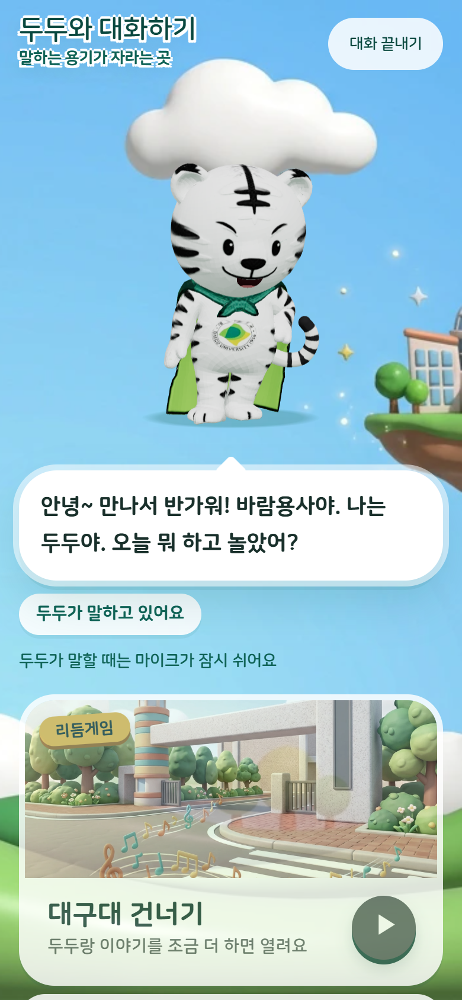
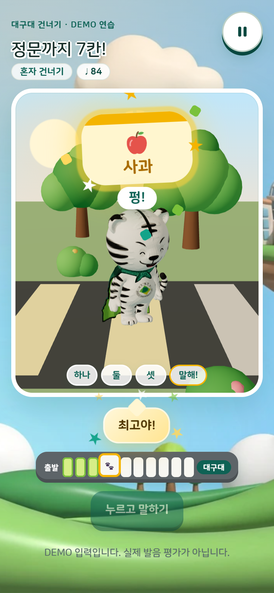
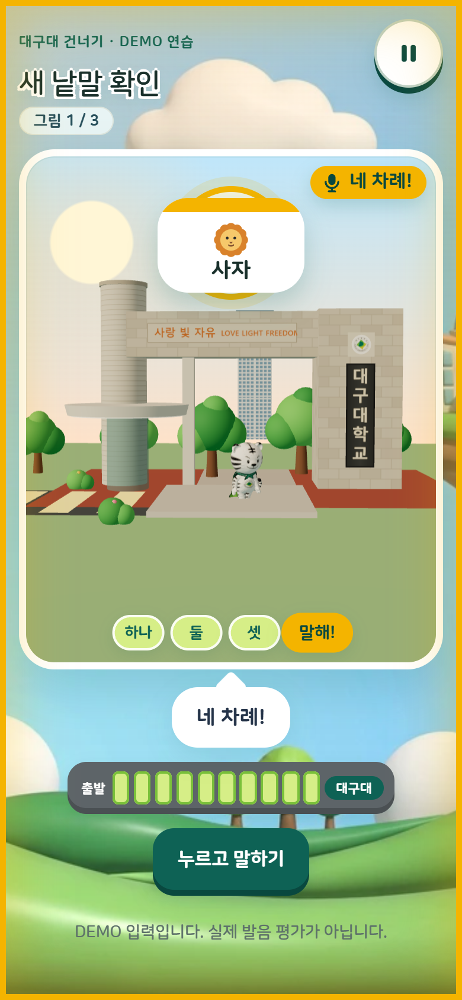
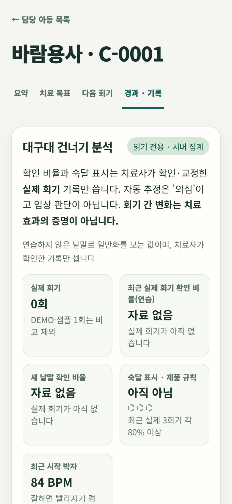
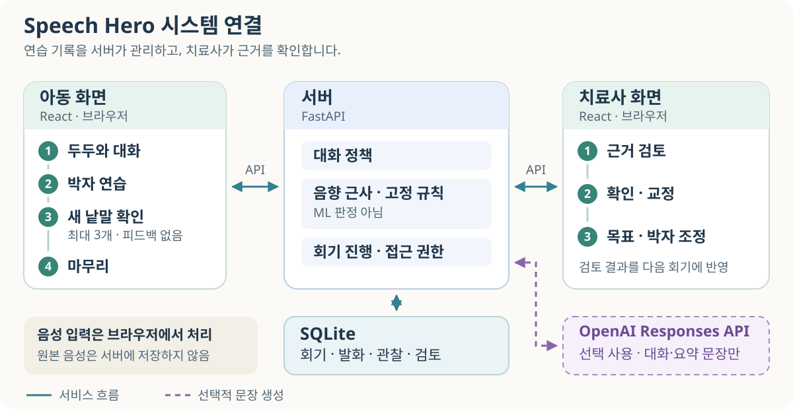
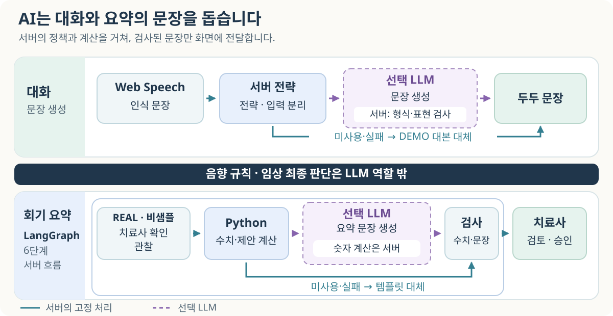

# Speech Hero

**두두와 말하며 연습하고, 치료사가 근거를 확인하는 언어치료 보조 웹 앱입니다.**

만 4~7세 아동을 위한 그림·박자 중심의 말하기 활동과 치료사 작업 공간을 제공합니다. 현재 시연의 목표는 <b>어두 /ㅅ/</b>입니다. 아동은 대화와 게임을 경험하고, 치료사는 관찰 기록을 확인·교정한 뒤 다음 목표와 박자를 정합니다. 시연은 아직 예정 또는 연기된 상태입니다.

> 게임의 진행·칭찬과 서버의 음향 자동 추정은 임상 정확도나 진단이 아닙니다. 불확실·무발화는 실패로 세지 않으며, 확인 자료가 없으면 ‘자료 없음’으로 표시합니다.

[화면 미리보기](#화면-미리보기) · [사용 흐름](#사용-흐름) · [시스템 구조](#시스템-구조) · [AI와 음성 기술](#ai와-음성-기술) · [빠른 시작](#빠른-시작) · [검사와 현재 상태](#검사와-현재-상태)

## 화면 미리보기

| 두두와 대화 | 대구대 건너기 | 새 낱말 확인 | 치료사 경과 · 기록 |
|:---:|:---:|:---:|:---:|
|  |  |  |  |
| 아이 말에 반응하며<br>/ㅅ/ 낱말 유도 | 넷째 박에<br>카드 낱말 말하기 | 칭찬·정오 없이<br>새 낱말 최대 3개 | 치료사가 확인한<br>기록으로만 비율 계산 |

로컬 DEMO 서버(외부 LLM 끔)를 Chrome의 휴대폰 화면 크기(390×844)로 열어 2026-10-10에 찍었습니다. DEMO 입력이라 발음 평가가 아니며, 게임 속 칭찬은 박자·시도에 대한 응원입니다. 치료사 화면의 ‘자료 없음’은 DEMO·샘플 기록을 비교에서 빼기 때문입니다.

## 한눈에 보기

| 영역 | 현재 제공하는 기능 |
|---|---|
| 아동 | 두두 대화 → 박자 연습 → 새 낱말 확인 → 마무리 |
| 치료사 | 담당 아동·목표·박자 설정, 관찰 확인·교정, 분리 집계, 다음 회기 계획 |
| 선택적 AI | 대화·요약 문장만 생성. 계산·판정·치료사 결정은 맡지 않음 |
| 캐릭터 자산 | 제작된 두두 음성·3D 모델을 앱에서 재생·표시 |
| 기본 실행 | 외부 LLM 없이 DEMO 대본·템플릿 사용 |
| 개발 상태 | 아동 시연 흐름과 치료사 검토·계획 구현, 이전 번호 작업 1~6번 완료 |
| 검증 상태 | 자동 검사 통과. 최신 버전의 실제 기기 전체 리허설·임상 검증·운영 준비가 남아 있음 |

## 사용 흐름

같은 아동의 대화와 게임 기록을 치료사 화면에서 각각 검토합니다. 두 기록을 묶는 상위 실행 회기는 아직 구현되지 않았습니다.

1. **두두와 대화:** 아동이 한 말에 반응하고 /ㅅ/ 낱말을 자연스럽게 유도합니다. 인식 문장의 목표 소리 관찰은 발음 정오 판단과 구분합니다.
2. **대구대 건너기:** ‘똑·똑·똑’ 다음 넷째 박에 말합니다. 한 판은 **5라운드 × 2줄 = 10줄**, 같은 회기에서 **최대 3판**입니다. 시작 박자는 기본 84 BPM이며 치료사가 시작값·빨라지기를 설정합니다.
3. **새 낱말 확인:** 마지막 판을 마치거나 ‘오늘은 그만할래’를 선택하면 연습하지 않은 그림 낱말을 최대 3개 확인합니다. 기본 후보는 사자·사탕·소풍이며, 연습·제외 낱말에 따라 달라집니다.
   - 시범·정오 피드백·칭찬·입 모양 도움말 없이 진행합니다. 안내는 자막만 사용합니다.
   - 매 시도 뒤 ‘들려줘서 고마워!’를 보입니다. 불확실·무발화일 때만 같은 카드를 최대 2번 듣습니다.
   - 확인 낱말은 ‘오늘 연습한 말’, 연습 비율·라운드·숙달 집계에 섞지 않습니다.
4. **마무리:** 오늘 연습한 말을 보여 주고 인사합니다.
5. **치료사 검토:** 회기에서 자동 추정의 근거와 음질을 살피고 확인·교정합니다. 연습과 새 낱말 확인 비율을 따로 보고 다음 목표를 정합니다.

치료사 화면의 **다음 회기 계획**은 근거 조회 → 초안 수정 → 승인까지 제공하지만, 승인 계획을 아동 게임에 자동으로 적용하는 기능은 아직 없습니다. 기존 Magic Beam·Sky Climb·Monster Adventure·Conversation Quest, 두두 홈·지도·보상도 저장소에 있습니다. 현재 주 시연 동선은 위 대화·건너기 흐름입니다.

## 시스템 구조



| 구성 | 기술 | 맡는 일 |
|---|---|---|
| 아동·치료사 화면 | React 18 · TypeScript · Vite | 그림 카드·박자·관찰 검토·회기 계획 |
| 두두·게임 장면 | Three.js · React Three Fiber · GLB | 캐릭터와 게임 렌더링, 로딩 실패 시 대체 표현 |
| 서버 | FastAPI · Pydantic | 인증·아동 소유권·상태·진행 규칙·응답 검사 |
| 기록 | SQLite · SQLAlchemy | 회기·발화 요약·관찰·이벤트·치료사 결정 |
| 계획 흐름 | LangGraph | 근거 조회부터 결과 검증까지 한 방향 6단계 |

브라우저에서 음성을 인식하거나 음향 특징을 측정해 서버에 보냅니다. 서버는 관찰과 진행 이벤트를 저장하고, 치료사에게 근거와 집계를 제공합니다. **원본 음성 파일은 앱 서버에 저장하지 않습니다.**

자세한 경로·데이터 흐름은 [아키텍처](docs/ARCHITECTURE.md), 변경 시 지킬 규칙은 [동결 계약](docs/audit/FROZEN_CORE_CONTRACT.md)에 있습니다.

## AI와 음성 기술



### 기술별 역할

| 기술 | 적용 방식 | 확인해야 할 경계 |
|---|---|---|
| Web Speech API | 대화와 일부 게임에서 한국어 인식 문장 생성 | 인식기가 틀린 발음을 표준 낱말로 보정할 수 있음 |
| Web Audio · VAD | 음량·발성 시간·마찰음·뒤 유성 구간·잡음 측정 | 음향 특징이며 혀 위치나 /ㅅ/·/ㅆ/ 차이를 확정하지 못함 |
| 서버 음향·문장 규칙 | 게임별 특징 비교, 문장 정규화·음소 변환·정렬 | 학습된 발음 판정 모델이 아닌 근사 분석 |
| OpenAI Responses API | 서버가 정한 전략에 맞는 대화 문장, 계산된 지표의 요약 문장 | 선택 기능. 발음 판정·수치 계산·목표 자동 변경을 맡지 않음 |
| LangGraph | 근거 조회 → 확인 자료 필터 → 수치 계산 → 제안 → 요약 → 검증 | 요약 단계에만 선택적 LLM 사용. 지표·제안은 Python 규칙 |
| VOLI 음성·브라우저 TTS | 미리 제작한 음성 우선, 없는 문장·재생 실패는 브라우저 음성으로 대체. AI가 답을 만드는 대화는 인사부터 브라우저 음성 하나로 말함 | 새 낱말 확인 단계에는 안내 음성을 사용하지 않음 |
| Meshy GLB | 제작된 두두 3D 모델을 게임에서 로드 | 실행 중 발음 판단에 쓰는 AI 모델이 아님 |

**대구대 건너기는 음성 인식 문장 없이 음향 특징으로 진행합니다.** 시작 마찰 60ms·뒤 유성 80ms·SNR 15dB는 현재의 임시 제품 기준입니다. 실제 아동·기기 자료로 보정해야 하며, 기준값과 선정 이유는 [HEURISTIC_REGISTER](docs/audit/HEURISTIC_REGISTER.md)에 기록합니다.

### 대화와 요약의 처리 방식

- **대화:** 서버가 먼저 전략을 선택합니다. 선택적 LLM이 짧은 한국어 문장을 만들면 서버가 형식·전략·허용 낱말·금지 표현을 검사합니다. 호출 실패·시간 초과·검증 실패는 DEMO 대본으로 대체합니다. 같은 발화의 재시도에는 같은 요청 ID를 사용해 저장된 응답을 복구합니다.
- **회기 계획 요약:** 실제·비샘플·치료사 확인 자료를 서버가 계산합니다. 새 낱말 확인은 연습·라운드·숙달에서 제외하지만, 확인·교정된 관찰은 일반 계획 근거에 포함될 수 있습니다. LLM은 계산 결과를 문장으로 옮기며, 입력에 없는 숫자나 금지 주장은 거부합니다. 다음 회기 제안은 서버 규칙으로 정하고, 실패하면 템플릿을 사용합니다.
- **검토와 승인:** 치료사가 확인·수정·승인합니다. 승인한 계획은 수정하지 않고 복제해 새 revision을 만듭니다. 계획을 아동 게임에 그대로 실행하는 연결은 후속 작업입니다.

두 LLM 경로는 기본으로 꺼져 있습니다. 대화의 최대 출력은 400토큰, 치료사 요약은 600토큰입니다. 자동 테스트는 가짜 transport/client를 사용합니다. 2026-10-07에는 당시 두 모델에 같은 대화 8턴을 각각 실제 호출했지만, 요약은 600토큰 한도에서 잘렸습니다. [당시 결과](docs/WORK_HISTORY.md)는 최신 main의 전체 실호출 회귀 검증이 아니므로 시연 전 다시 확인해야 합니다. 학습형 한국 아동 발음 모델 실험은 적합한 데이터 부족으로 미실행이며, [연구 결론](research/pronunciation/reports/pronunciation_final.md)에 남아 있습니다.

<details>
<summary>클라우드 설정과 외부 전송 범위</summary>

키는 서버 환경에만 둡니다. 프런트엔드 변수·소스·빌드에 넣지 않습니다. 모델 이름은 코드에 고정하지 않고 서버 설정으로 선택합니다.

| 용도 | 필요한 서버 설정 |
|---|---|
| 두두 대화 | `HOYA_CHAT_ENABLED=true`, `HOYA_CHAT_PROVIDER=openai`, `HOYA_CHAT_MODEL`, `OPENAI_API_KEY` |
| 치료사 계획 요약 | `THERAPIST_SUMMARY_ENABLED=true`, `THERAPIST_SUMMARY_MODEL`, `OPENAI_API_KEY` |

- 대화에는 현재 인식 문장, 최근 완료 대화, 목표·단서·전략·연령대가 전송됩니다. 서버가 이름·계정·play code를 별도 식별 필드로 붙이지는 않지만, **아동이 말한 개인정보는 인식 문장에 포함될 수 있습니다.** 보호자 동의가 있는 아동만 대화를 시작합니다.
- 치료사 요약에는 목표·서버 집계·추이·제안만 보내고 이름·ID·인식 문장·치료사 메모는 제외합니다.
- 코드의 `store=False`는 API 응답 저장 옵션이며 외부 제공자의 모든 자료 보존이 없다는 뜻으로 해석하지 않습니다.
- Web Speech 인식과 온라인 브라우저 TTS가 제공자 서비스를 쓸 수 있으므로 완전 오프라인 처리라고 설명하지 않습니다.

설정 예시는 [backend/.env.example](backend/.env.example), 계획·AI 경계는 [치료사 업무 흐름](docs/therapist-workflow.md)에 있습니다. VOLI 음성의 사용 조건·출처는 [음성 제작 기록](docs/handoff/DUDU_VOICE_VOLI_2026-10-05.md), 모델 제작 과정은 [3D 제작 자료](assets/dudu3d/README.md)를 확인합니다.

</details>

## 빠른 시작

Windows PowerShell 기준입니다. Node.js **22.12 이상**과 npm, Python 환경이 필요합니다. CI의 백엔드 검증 버전은 **Python 3.14**입니다. 실제 마이크는 권한과 HTTPS 또는 localhost 보안 컨텍스트가 필요합니다.

### 1. 의존성 설치

저장소 루트에서 실행합니다. Windows PowerShell에서는 `npm.cmd`로 실행합니다.

```powershell
npm.cmd ci
cd backend
python -m venv .venv
.venv\Scripts\python.exe -m pip install -r requirements.txt
cd ..
```

### 2. 백엔드 실행

별도 터미널에서, 저장소 루트를 기준으로 실행합니다. 아래는 외부 LLM을 끈 로컬 DEMO 설정입니다. DB는 Git에서 제외되는 `backend/test-temp`에 둡니다.

```powershell
cd backend
New-Item -ItemType Directory -Force test-temp | Out-Null
$env:DATABASE_URL = 'sqlite:///./test-temp/readme-demo.db'
$env:SEED_DEMO_DATA = 'true'
$env:COOKIE_SECURE = 'false'
$env:HOYA_CHAT_ENABLED = 'false'
$env:THERAPIST_SUMMARY_ENABLED = 'false'
$env:OPENAI_API_KEY = ''
.venv\Scripts\python.exe -m uvicorn app.main:app --host 127.0.0.1 --port 8000
```

서버는 `backend/.env`도 읽으며 같은 이름의 OS 환경 변수가 우선합니다. `.env`, DB, 키·인증서는 커밋하지 않습니다.

AI 대화와 치료사 요약을 켜려면 [backend/.env.example](backend/.env.example)을 `backend/.env`로 복사해 아래처럼 고칩니다.

- AI: `HOYA_CHAT_ENABLED=true`, `THERAPIST_SUMMARY_ENABLED=true`, 두 모델 이름, `OPENAI_API_KEY`
- 로컬 DEMO: 위 `$env:` 줄과 같은 `DATABASE_URL`, `SEED_DEMO_DATA=true`, `COOKIE_SECURE=false`

권장 모델은 `gpt-5.4-mini`입니다. 기본 추론 단계가 `none`이라 대화 제한 시간(8초) 안에 답합니다. 서버는 위의 `$env:` 줄을 실행하지 않은 새 PowerShell 창에서 `cd backend` 뒤 `uvicorn` 줄만 실행합니다. `$env:` 값이 `.env`보다 우선하기 때문입니다. 백엔드 테스트는 `backend/.env`를 읽지 않으므로 거기 넣은 키로 실제 API를 부르지 않습니다.

### 3. 프런트엔드 실행

다른 터미널에서 저장소 루트를 기준으로 실행합니다.

```powershell
npm.cmd run dev -- --port 5173 --strictPort
```

- 화면: **http://127.0.0.1:5173**
- API 문서: **http://127.0.0.1:8000/docs**
- `/api` 요청은 Vite가 백엔드 8000으로 전달합니다.
- 로컬 DEMO에서는 로그인 화면의 ‘**DEMO 아동으로 시작**’·‘**DEMO 치료사로 시작**’을 사용합니다. 샘플 계정은 `SEED_DEMO_DATA=true`일 때만 활성화됩니다.
- 마이크 없이 건너기를 확인하려면 ‘**DEMO로 시작(누르고 말하기)**’을 선택하고 `Space`를 누릅니다.

기존 서버가 이 포트를 사용 중이면 종료하지 말고 빈 포트와 Vite 프록시·CORS를 함께 맞춥니다. 휴대폰에서의 `localhost`는 휴대폰 자신이므로, 실제 휴대폰 시험은 같은 네트워크의 PC 주소·HTTPS가 필요합니다.

<details>
<summary>실제 시연 DB·운영 실행</summary>

전용 시연 DB·계정 생성, 리허설 기록 초기화와 휴대폰 HTTPS 연결은 [시연 진행표](docs/handoff/DEMO_RUNSHEET_2026-10-05.md)를 따릅니다. 시연 DB 도구는 새 파일을 명시해 만들며 실제 자료 DB에 사용하지 않습니다.

운영 제공 경로는 빌드된 화면과 API를 FastAPI 하나에서 서비스하는 방식입니다. 운영 가능 판정을 뜻하지 않으며, HTTPS·보호 설정·실제 기기 검수가 필요합니다.

```powershell
npm.cmd run build
cd backend
$env:FRONTEND_DIST = '..\dist'
$env:SEED_DEMO_DATA = 'false'
$env:COOKIE_SECURE = 'true'
$env:CORS_ORIGINS = 'https://<서비스 주소>'
# 실제 서비스의 데이터베이스·호스트 설정은 서버 환경에 지정합니다.
.venv\Scripts\python.exe -m uvicorn app.main:app --host 127.0.0.1 --port 8000
```

앞단 HTTPS 프록시는 응답 보안 헤더를 유지합니다. `FRONTEND_DIST`가 비면 API만 제공하고, 없는 정적 파일·API는 404입니다.

</details>

## 치료사 사용 예시

**담당 아동 → 요약 → 치료 목표 → 다음 회기 → 경과 · 기록** 순서입니다.

- **치료 목표:** /ㅅ/ 설계 근거, 대상별 빠른 설정, 시작 박자·빨라지기 저장.
- **회기 상세:** 시도를 선택해 음향 근거·음질·단서를 확인하고 기존 결정과 다른 경우 교정. 새 낱말 확인은 별도 영역으로 표시.
- **경과 · 기록:** 연습·새 낱말 확인 비율, 단계별 기록, 시작 박자, 자동 추정 이유. 대화는 최근 회기별 완료 턴·목표 관찰·불확실·무발화 집계로 조회하며 발화 전문은 표시하지 않음.
- **다음 회기:** 확인된 관찰 근거로 제안 확인 → 초안 수정 → 승인. 제안 자체가 목표를 자동 변경하지 않음.

건너기 비교는 **REAL·비샘플·치료사 확인/교정 자료**만 사용합니다. DEMO·샘플·불확실·무발화·음질 POOR는 확인 비율의 분모에서 제외합니다. ‘숙달 표시’는 최신 실제 3회기의 연습 확인 비율이 각각 80% 이상인 제품 규칙이며 임상 숙달 확정이 아닙니다. 확인 자료가 없으면 비율은 `null`입니다.

## 검사와 현재 상태

**자동 검사 기준: 2026-10-09, PR #33이 병합된 main `575f8b2`.** 아래 수치는 앱의 임상 효과를 측정한 결과가 아닙니다.

| 검사 | 확인 결과 |
|---|---|
| 프런트 | 타입 검사·47개 파일의 **343개 테스트**·빌드 통과 |
| 백엔드 | **574개 테스트** 통과 |
| 합계 | **917개 자동 테스트** 통과 — 임상 정확도·코드 커버리지를 뜻하지 않음 |
| API·의존성 | DEMO API smoke **3항목**(기존 게임·계획·대화), npm audit high 이상 **0건**. 건너기 자체는 이 smoke에 포함되지 않음 |
| 브라우저 | 10/8 Edge **1280px·390px** DEMO 동선에서 연습 **20회**·확인 **6회** 저장·분리 확인(동일 앱 코드, 문서 변경 전) |
| 실제 OpenAI | 10/7 두 모델에 같은 대화 8턴을 각각 보낸 제한된 시험. 당시 요약은 600토큰 한도에서 잘려 최신 설정으로 재시험 필요 |
| 미검증 | 최신 main의 실제 휴대폰·마이크 전체 리허설, 아동 음성 정확도·임상 평가, 운영 환경 |

[PR #33 병합 뒤 main CI](https://github.com/Riddlerio/s_project/actions/runs/37946919642)의 프런트·백엔드 두 잡이 모두 통과했습니다. 브라우저 수치는 DEMO 점검이며, 실제 아동의 치료 효과 수치가 아닙니다. 이전 성인 마이크 실측·제한된 사용자 아이폰 시험은 [마이크 측정 기록](docs/handoff/MIC_MEASUREMENT_2026-10-05.md), 선택적 LLM의 짧은 실제 호출은 [작업 기록](docs/WORK_HISTORY.md)에 있습니다.

### 검사 명령

저장소 루트에서 실행합니다. API smoke 전에 위 DEMO 백엔드를 띄웁니다.

```powershell
npm.cmd run typecheck
npm.cmd test
npm.cmd run build
npm.cmd audit --audit-level=high
backend\.venv\Scripts\python.exe -m pytest backend/tests -q -p no:cacheprovider --basetemp backend/test-temp/readme-ci
backend\.venv\Scripts\python.exe backend/scripts/smoke_api.py http://127.0.0.1:8000
git diff --check
```

[GitHub Actions](.github/workflows/ci.yml)는 PR과 `main`·`claude/**`·`codex/**` push에 타입·테스트·빌드·의존성 감사·DEMO API smoke를 실행합니다. 빌드에는 dist 자격 증명 검사가 포함됩니다. 자동 배포·브랜치 보호 설정은 이 워크플로에 포함되지 않습니다.

## 문제 해결과 알려진 한계

| 증상·항목 | 확인할 것 |
|---|---|
| 마이크가 안 켜짐 | 권한·HTTPS/localhost·브라우저 지원 확인. DEMO로 화면 동선 확인 가능 |
| 인식 문장이 실제 발음과 다름 | Web Speech의 표준어 보정 가능성. 치료사가 직접 관찰한 발음으로 판단 |
| 3D 모델 로딩·WebGL 실패 | 대체 캐릭터 표현으로 진행. 실제 기기 GPU·렌더링 검수는 별도 |
| 포트 사용 중·API 연결 실패 | 백엔드 포트·Vite 프록시·허용 CORS 주소를 함께 맞춤 |
| Windows Python 실행 차단 | 보안 정책을 끄거나 우회하지 않음. 허용된 uv 기본 Python과 이미 설치된 의존성 경로로 실행 |
| pytest 임시 폴더 접근 오류 | Git에서 제외되는 새 `backend/test-temp` 경로와 `-p no:cacheprovider` 사용 |
| 빌드 경고 | 기존 Vite 설정 호환 안내·큰 JS 번들 경고가 남아 있음 |
| 사이트 아이콘 요청 | `favicon.ico` 404가 남아 있으며 API 동작과 별개 |

Windows에서 가상환경 실행 파일만 차단된 경우, `backend`에서 **이미 의존성이 설치된 가상환경**을 참조해 아래처럼 실행할 수 있습니다. 이 저장소의 검수도 허용된 uv Python과 기존 의존성 경로를 사용했습니다.

```powershell
cd backend
$taskPython = uv python find 3.14
$taskSitePackages = Join-Path $PWD '.venv\Lib\site-packages'
$env:PYTHONPATH = "$PWD;$taskSitePackages"
& $taskPython -m pytest -q -p no:cacheprovider --basetemp test-temp/readme-ci
# 서버도 같은 환경에서 실행할 수 있습니다.
# & $taskPython -m uvicorn app.main:app --host 127.0.0.1 --port 8000
```

**시연 전 할 일:** 최신 버전의 실제 기기 전체 리허설, 클라우드 응답·지연·요약 길이 재확인, 현장 네트워크·백업 영상·시연 버전 확정. 우선순위는 [로드맵](docs/ROADMAP.md)에 정리했습니다. 운영 준비와 임상 유효성 검증은 완료되지 않았습니다.

## 개인정보와 API

- 로그인은 HttpOnly·SameSite 쿠키를 사용합니다. 변경 요청에는 CSRF 값과 Origin을 검사하고, 역할·담당 아동 소유권·회기 리스를 서버에서 확인합니다.
- 서버에 인식 문장·음향 특징·회기 기록을 저장합니다. 기본 90일이 지난 인식 문장·대체 후보·대화 응답 등은 비우지만, 모든 회기·음향 기록이 자동 삭제되는 것은 아닙니다.
- 외부 전송 범위는 위 [클라우드 설명](#ai와-음성-기술)을 확인합니다. 개발용 샘플 계정은 운영 계정으로 사용하지 않습니다.
- 운영 화면에는 CSP·프레임 차단 등 응답 보안 헤더를 적용합니다. 상세 설정은 [환경 변수 예시](backend/.env.example)와 [동결 계약](docs/audit/FROZEN_CORE_CONTRACT.md)을 따릅니다.

| 주요 API | 용도 |
|---|---|
| `/api/auth/login`, `/api/auth/logout` | 쿠키 인증 |
| `/api/hoya/chat/sessions` | 두두 대화 시작·턴·완료 |
| `/api/activities/{id}/utterances` | 연습·확인 발화 요약 제출 |
| `/api/activities/{id}/laps`, `/api/activities/{id}/probes` | 판 반복·새 낱말 확인 시작 |
| `/api/play/sessions/{id}/complete` | 회기 마무리 |
| `/api/sessions/{id}/timeline` | 회기 관찰·이벤트 조회 |
| `/api/sessions/{id}/clinical-summary`, `/api/sessions/{id}/insights` | 임상 요약·읽기 전용 지표 |
| `/api/therapist/children/{id}/crossing-analytics` | 연습·새 낱말 확인 분리 집계 |
| `/api/observations/{id}/decision` | 치료사 확인·교정·거부 |

## 프로젝트와 문서

코드에서 직접 참조하는 경로가 있어 실행 폴더는 현재 위치를 유지합니다. 각 폴더 README에서 진입점과 수정 시 주의점을 확인할 수 있습니다.

| 폴더 | 역할 |
|---|---|
| [src](src/README.md) | 아동·치료사 화면, 브라우저 음성, 게임·두두 3D |
| [backend](backend/README.md) | FastAPI, 데이터·진행 규칙, 테스트 |
| [public](public/README.md) | 앱에서 직접 제공하는 그림·음성·GLB·글꼴 |
| [assets](assets/README.md) | 두두 3D 제작 원본과 검토 도구 |
| [shared](shared/README.md) | 화면·서버가 함께 참조하는 JSON 기준 자료 |
| [scripts](scripts/README.md) | 빌드 검사·자산 생성·휴대폰 시험 도구 |
| [docs](docs/README.md) | 설계·근거·시연·결정 기록과 문서 길잡이 |
| [research](research/README.md) | 제품 실행과 분리된 발음 연구 |
| [.github](.github/workflows/README.md) · [.agents](.agents/README.md) | CI와 작업 지침 |

시스템을 더 자세히 보려면 [아키텍처](docs/ARCHITECTURE.md)와 [치료사 업무 흐름](docs/therapist-workflow.md), 변경 경계는 [동결 계약](docs/audit/FROZEN_CORE_CONTRACT.md)을 읽으세요. 현재 할 일은 [로드맵](docs/ROADMAP.md), 완료 기록은 [작업 기록](docs/WORK_HISTORY.md)에 있습니다.
