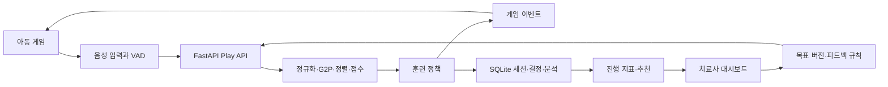

# Speech Hero 구조

## 시스템 흐름

브라우저의 아동 화면은 DEMO 스크립트 또는 Web Speech API로 인식한 텍스트와 발성 시간 특성을 서버에 전달합니다. 서버는 발화를 분석하고 훈련 정책을 적용해 게임 이벤트를 반환합니다. 치료사 화면은 세션 지표, 분석과 결정 근거를 조회합니다.

## 주요 데이터

`TrainingGoal`은 목표 버전을 보존합니다. `TrainingPlan`은 세션의 슬롯과 순서를 고정하고, `TrainingSession.runtime_state`는 현재 항목·시도·단계·XP를 기록합니다. `Utterance`와 `SpeechAnalysis`는 입력과 근사 분석을 분리합니다. `TrainingDecision`은 판단 근거를, `GameEvent`는 게임 동작과 치료사 설명을 저장합니다. `ProgressMetric`과 `AIRecommendation`은 세션 완료 후 생성됩니다.

## 정책과 이벤트

같은 항목을 재시도하며 단서와 힌트를 제공하고, 연속 목표 재시도 후 낮은 단계에서 연습합니다. 강화 단계에서 연속 성공하면 원래 항목으로 복귀합니다. Magic Beam은 발성 시간만으로 성공을 판단하며 몬스터 타워의 연속 성공·재시도 횟수에는 영향을 주지 않습니다. 각 계획 슬롯의 ID는 고유합니다.

아동 게임 이벤트는 성공·재시도·단계 변화·보상을 표현합니다. 치료사 로그는 같은 이벤트를 한국어 관찰 문장으로 설명합니다. AI 점수와 대치 유형은 아동 응답에 포함하지 않습니다.

## 결정 사항과 경계

- 아동 화면은 발화가 조작 수단입니다. DEMO 모드의 `Space`는 발성 시간 입력 대체이며 화면에 표시됩니다.
- 세션 중 정책은 기존 목표 범위에서 조정합니다. 목표 자체는 치료사 결정으로만 새 버전을 만듭니다.
- 추천은 자동 적용되지 않습니다. 치료사가 수락하거나 사유를 기록해 거절합니다.
- 원본 음성은 저장하지 않습니다. 텍스트는 설정한 보존 기간 이후 시작 시 비웁니다.
- 실제 음성 모드는 Web Speech API에 의존합니다. 임상 진단이나 실시간 음향 진단은 범위 밖입니다.

상세 구현 범위와 남은 검증 항목은 `README.md`에 기록했습니다.
