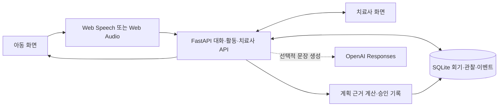

# Speech Hero 시스템 구조

## 시스템 흐름

아동과 치료사 화면은 React 앱 하나에서 분리된 경로로 제공됩니다. 아동의 두두 대화는 Web Speech 인식 문장을, 대구대 건너기는 Web Audio의 음향 특징을 주로 사용합니다. FastAPI가 소유권·회기 상태·진행 규칙을 검사하고, 결과와 근거를 SQLite에 기록합니다. 치료사는 기록을 확인·교정하며 다음 회기 계획을 별도로 승인합니다.

## 주요 데이터

`TrainingGoal`은 장기 목표의 버전을 보존합니다. `TrainingPlan`은 실행 슬롯을, `TrainingSession.runtime_state`는 활동의 현재 위치·시도를 보존합니다. `HoyaChatSession`은 대화 회기를 따로 저장합니다. `Utterance`와 `SpeechAnalysis`는 제출 내용과 근사 분석을 나누고, `ClinicalObservation`과 치료사 결정은 자동 추정과 사람 확인을 구분합니다. `GameEvent`는 진행 사건을 기록합니다. `TherapistSessionPlan`은 다음 회기의 초안·승인·개정본이며 현재 아동 게임의 실행 계획과 자동 연결되지 않습니다.

## 정책과 이벤트

서버는 대화 전략과 건너기 진행을 결정하고, 음향 측정은 임시 기준으로 success·retry·uncertain·no_speech를 구분합니다. 불확실·무발화·음질 불량을 아이의 실패로 집계하지 않습니다. 아동 화면의 점프·박 맞춤 칭찬은 진행 연출이며 임상 점수가 아닙니다. 치료사 화면에는 자동 추정의 이유와 자료 출처를 보여 주고, 확인·교정한 실제 비샘플 자료만 비교 집계에 사용합니다. 새 낱말 확인은 연습·라운드·숙달 집계에서 분리합니다.

## 두두 대화와 대구대 건너기

- **대화 → 게임 전환:** 대화 턴 응답에 `nextActivity`(`"daegu_crossing"` 또는 `null`) 하나만 더했습니다. 서버가 목표 낱말 시도(`TARGET_OBSERVED`, 정확한 발음 아님) 횟수와 서버 시간으로 정하고(`hoya/transitions.py`), 아동 화면은 이 값이 오면 아래 '대구대 건너기' 버튼을 빛냅니다.
- **대구대 건너기(`daegu_crossing`):** 브라우저의 `OnsetPipeline`이 소리 시작의 마찰 구간과 그 뒤 유성 구간을 재서 기존 음향 요약 필드로 보냅니다. 서버 `ONSET_FRICATION` 규칙이 success·retry·uncertain·no_speech를 정하고(`games/evaluation.py`), 진행(5라운드 × 2줄, 줄당 3번)은 `games/crossing.py`가 맡습니다. 두두의 점프·'딱 맞았어!' 같은 효과는 서버 결과를 따라가는 화면 연출이며 저장하지 않습니다. 관찰은 기존 관찰 생성기로 치료사 타임라인에 들어갑니다.
- **두두 목소리:** `KoreanTts`는 말의 모든 문장이 `shared/dudu_voice_lines.json`에 있으면 음성 파일을 재생하고, 아니면 브라우저 `speechSynthesis`로 말합니다. 두 경우 모두 두두가 말하는 동안 마이크 입력을 막고, 끝난 뒤 300ms를 기다려 다시 엽니다.

- **리듬과 치료사 박자 설정:** 건너기를 시작할 때 서버가 그 아동의 설정을 회기 상태에 `rhythm: {startBpm, allowFaster}` 스냅숏으로 남기고, 시작·재개 응답에 넣습니다.
  - 설정 API는 `GET/PUT /api/therapist/children/{child_id}/game-settings`입니다(시작 박자 76~100·기본 84, 빨라지기 기본 켬, 감사 기록 `GAME_SETTINGS_UPDATE`).
  - 화면은 값이 없으면 84/켬을 씁니다. 치료사 회기 응답의 `crossingSummary`는 그 회기의 스냅숏만 보여 줍니다.

### 대구대 건너기·대화 전환 API 약속 (2026-10-05 확정)

화면 구현은 `src/api/hoyaChat.ts`와 `src/api/daeguCrossing.ts`의 타입을 기준으로 연결한다. 아래 표는 2026-10-05부터 확장한 API 계약의 기록이다.

| 대상 | 확정 필드·의미 |
|---|---|
| 대화 턴 200 | 기존 `status, turnIndex, clientRequestId, text, nextTurnIndex, sessionComplete` 유지. `nextActivity: "daegu_crossing" \| null`만 추가 |
| 대화 202 | 기존 처리 중 응답 유지. 완료한 요청 재전송은 저장한 같은 문구·전환 값을 반환 |
| 활동 시작 | `POST /api/activities`, 요청 `{game:"daegu_crossing", mode:"real"\|"demo"}`. 응답 타입 `DaeguCrossingStart` |
| 시작·재개 응답 | `sessionId, game, mode, heroName, rounds, currentRound, firstItem, nextAttemptIndex`와 아래 진행 필드. 재개 타입은 `DaeguCrossingSnapshot`. 완료 상태에서는 `firstItem/currentRound=null`. 재개 경로의 `leaseToken, completedRounds` 보존 |
| 진행 필드 | `roundIndex` 1~5, `itemIndexInRound` 1~2, `stripeIndex` 1~10, `triesLeft` 0~3, `modelCue` boolean, `sessionComplete` boolean(이번 판의 끝), `lap` 1~3, `maxLaps` 3(2026-10-07) |
| 발화 요청 | 기존 `POST /api/activities/{sessionId}/utterances`. `roundIndex, itemId, attemptIndex, transcript, acoustic, recognizer, attack:"basic"`. lease가 있으면 `X-Activity-Lease` 헤더 |
| 발화 응답 | 타입 `DaeguCrossingResponse`: `result: "success"\|"retry"\|"uncertain"\|"no_speech"`, `events, nextItem, nextAttemptIndex, currentRound`와 진행 필드 |
| 다음 판 | `POST /api/activities/{sessionId}/laps`(요청 본문 없음, lease가 있으면 `X-Activity-Lease`). 판을 마친 같은 회기에서 첫 줄부터 다시 시작하고 시작 응답과 같은 형식 + `events`(`LAP_START, ROUND_START, TARGET_PRESENTED`)를 준다. 판을 다 건너지 않았거나 3판을 넘거나 끝난 회기면 409 |
| 새 낱말 확인 시작 | `POST /api/activities/{sessionId}/probes`(본문 없음, 같은 lease·소유·상태 검사). 판 완료 뒤 한 번만 시작한다. 다른 아동 404, 진행 중·중복·끝난 회기 409. 이후 `/laps`는 409. 시작 응답과 같은 모양이지만 낱말 없으면 `firstItem/currentRound=null` |
| 확인 진행 필드 | `probeStarted`, `probeComplete`, `probeIndex`(시작 전·낱말 없음 0, 그 외 1~3), `probeTotal`(0~3). 확인 중 `modelCue=false`, 연습 위치 5/2/10 보존, `sessionComplete=false`; 확인 완료·낱말 없음은 `sessionComplete=true`. 상태에는 `probeItems`·`probeAttemptsUsed`도 저장 |
| 확인 발화 응답 | 같은 `/utterances`·음향 규칙·저장 경로. 확인 중에는 `result`가 없고 중립 `PROBE_RECORDED`·마지막 `PROBE_COMPLETE`만 반환. 시작은 `PROBE_START`(`wordN`), 불확실·무발화 최대 2번 뒤 다음 카드. 회기 완료는 확인 여부와 무관하게 가능 |
| 치료사 확인 기록·집계 | 관찰 `isProbe`, `crossingSummary.probeN`(기록한 고유 낱말)·`probeAttemptN`(발화 수). 회기별 분석 `probe:{reviewedN,confirmedSuccessN,confirmedRate}`. REAL·비샘플·치료사 확인 필터, 자료 없음 `null`. 연습 비율·숙달·라운드 집계에서 분리. 기존 evidence JSON 표시, 새 DB 표·열 없음 |
| 항목 | 타입 `DaeguCrossingItem`: `itemId, displayText, level, game:"daegu_crossing", pictureKey` |
| 라운드 | 타입 `DaeguCrossingRound`: `index, id, childTitle, childPrompt`. 임상 메타는 아동 응답에 포함하지 않음 |

- 진행 번호·남은 시도·시범 여부는 **응답 후 표시할 다음 항목** 기준이다. `result`는 방금 제출한 항목의 음향 근사 결과다.
- 최초 값은 1/1/1, `triesLeft=3`, `nextAttemptIndex=1`이다. 새 항목에서는 시도 번호와 남은 시도를 초기화한다.
- 같은 항목에서 `nextAttemptIndex`는 수락한 제출마다 증가한다. `uncertain/no_speech`의 제출 번호도 증가하지만 `triesLeft`는 줄지 않는다. 서버가 반환한 번호를 그대로 다음 요청에 사용한다.
- 완료 시 번호는 5/2/10에 머무르고 `nextItem=null, currentRound=null, triesLeft=0, modelCue=false, sessionComplete=true`다.
- 음질 보류·무발화는 평가 시도를 소모하지 않는다. 같은 줄에서 연속 세 번이면 중립적으로 다음 줄로 이동한다.
- 점수·정확도·판정 근거는 새 아동 응답에 넣지 않는다. 관찰은 기존 치료사 API에서만 검토한다.
- 일반화 확인은 은행에서 연습·제외 낱말을 뺀 첫 3개(기본 사자·사탕·소풍), 그림 카드와 아이 마디만 쓴다. 자막 '들려줘서 고마워!' 외에 시도 결과에 대한 피드백을 주지 않고 마무리의 연습 목록에서 뺀다. 확인 단계에는 두두 음성·브라우저 음성이 없다.
- 대화 전환은 목표 관찰 시도 10회 이상+서버 시간 120초 이상, 또는 300초 이상이다. 연속 무발화 3회에는 쉬운 질문을 먼저 하고, 그 다음에도 무발화면 전환한다.
- 판정 기준(2026-10-05 실측 반영, `docs/handoff/MIC_MEASUREMENT_2026-10-05.md`): 시작 마찰 60ms(2026-10-06 70→60)·이후 유성 80ms 이상이면 success. 잡음보다 15dB 미만이면 uncertain. 성인 1명 PC 마이크 측정값이며 임상 검증이 아니다.

## 결정 사항과 경계

- 아동 화면은 발화가 조작 수단입니다. DEMO 모드의 `Space`는 발성 시간 입력 대체이며 화면에 표시됩니다.
- 세션 중 정책은 기존 목표 범위에서 조정합니다. 목표 자체는 치료사 결정으로만 새 버전을 만듭니다.
- 추천은 자동 적용되지 않습니다. 치료사가 수락하거나 사유를 기록해 거절합니다.
- 원본 음성은 저장하지 않습니다. 텍스트는 설정한 보존 기간 이후 시작 시 비웁니다.
- 실제 음성 모드는 Web Speech API에 의존합니다. 임상 진단이나 실시간 음향 진단은 범위 밖입니다.

상세 구현 범위와 남은 검증 항목은 [프로젝트 README](../README.md)에 기록했습니다.
