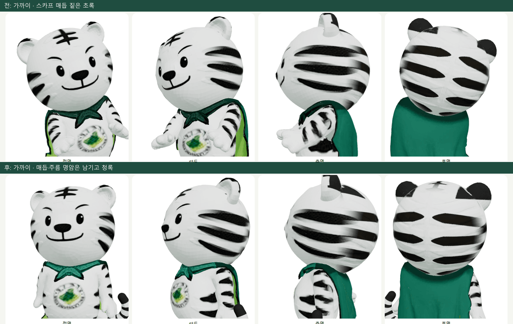
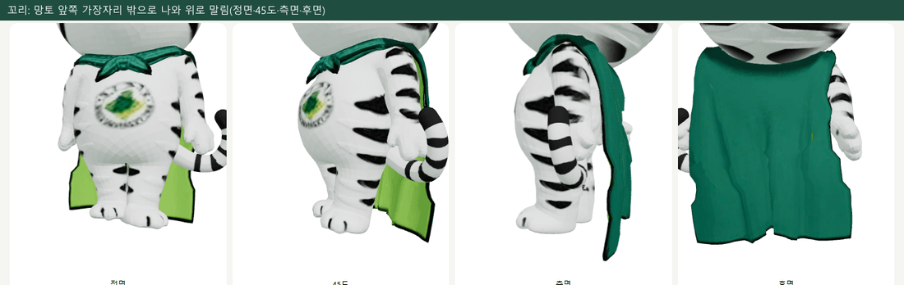
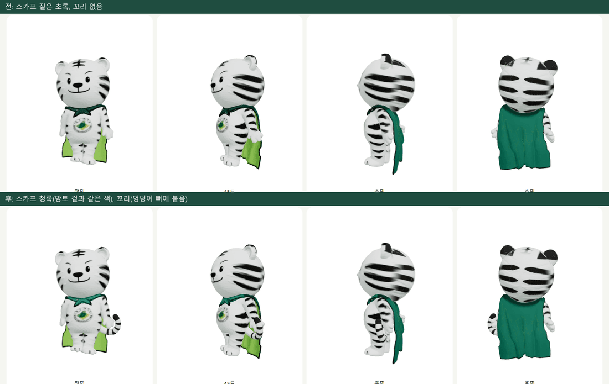
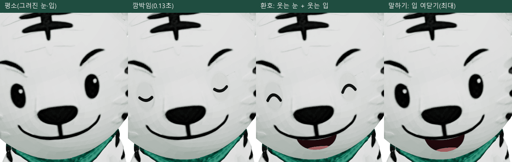
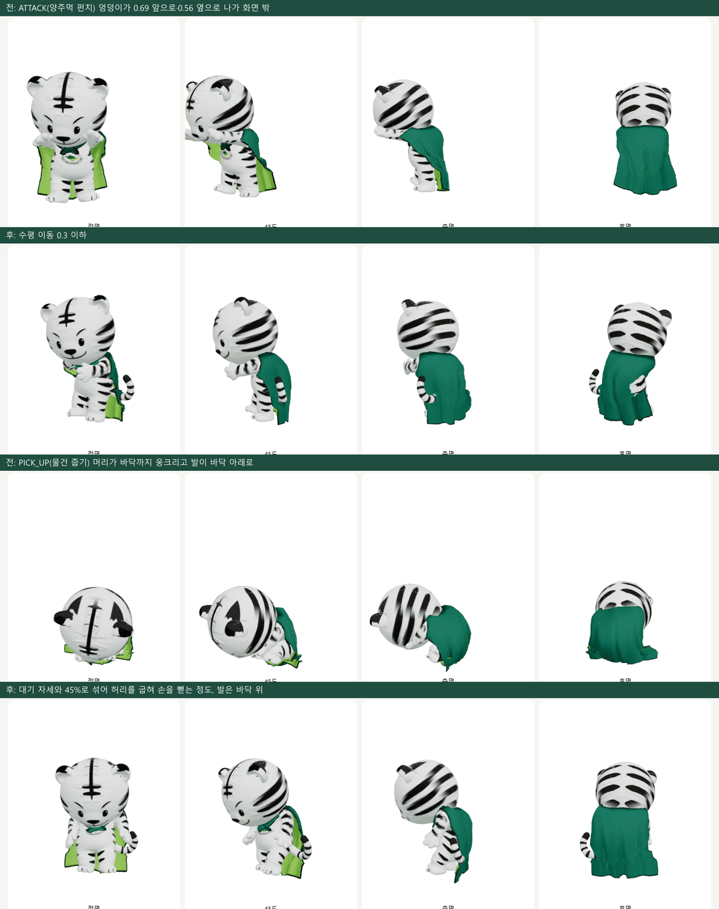
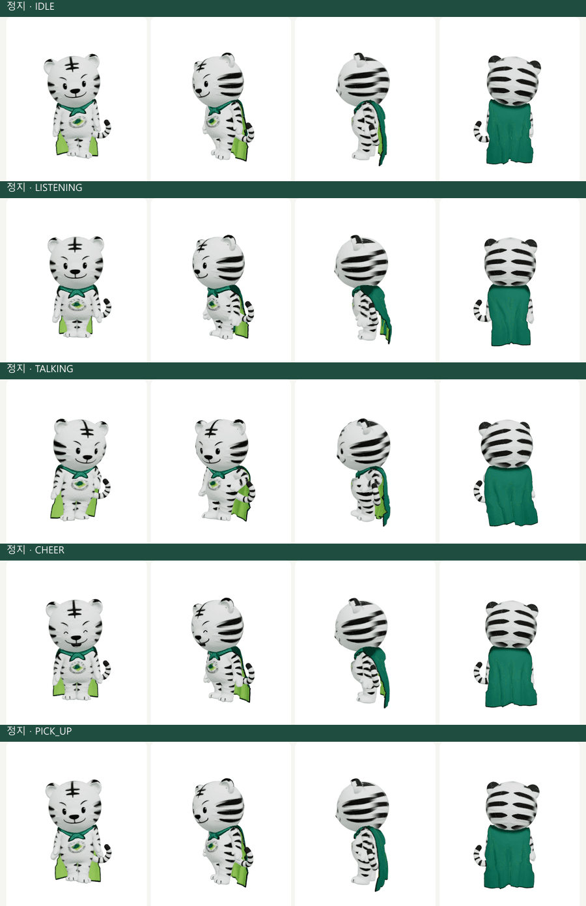
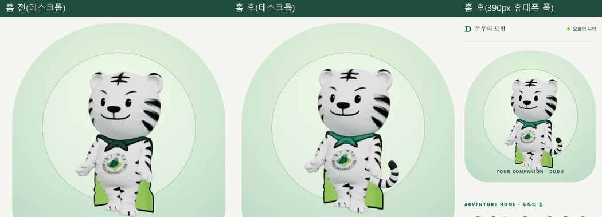
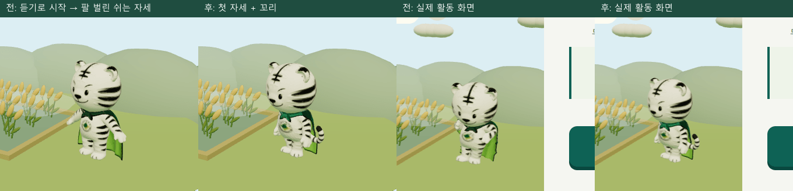

# Claude 인계 · 두두 3D 품질 다듬기 (2026-10-04)

> 범위: 이미 연결된 Meshy 두두 모델의 남은 품질 작업(스카프 → 꼬리 → 표정·기존 동작 → 홈·빛의 마법 확인). 같은 날 이어서 사용자가 준 공식 흉장으로 흉장을 바꿨다(2.6절).
> 새 게임, 새 치료 규칙, 새 AI 기능은 더하지 않았다. 화면이 뜨는 것은 **원화 충실도 승인이 아니다**. 사람의 최종 검수는 아래 7절에 남겼다.

## 1. 시작 상태와 경계

- 작업 폴더 `C:\Users\kor02\orca\workspaces\s_project\dudu_claude`, 브랜치 `claude/dudu-followup`, 시작 커밋 `787f031`(원격과 같음, 미커밋 변경 없음). 실행 중인 다른 서버·프로세스 없음.
- 읽고 코드와 대조한 문서: `CLAUDE_TO_CODEX_CONTINUATION.md`, `CODEX_CONTINUATION_2026-10-04.md`, `CODEX_THERAPIST_DATA_TASK.md`, `FROZEN_CORE_CONTRACT.md`, `ROADMAP.md`, `assets/dudu3d/README.md`, `docs/history/2026-10-04.md`. Meshy 연결, 망토·뒷머리 텍스처, V2 seed, legacy 모험 제거는 완료 기록이 있어 다시 만들지 않았다.
- 고친 곳: `assets/dudu3d/**`, `public/assets/dudu/dudu.glb`, `src/tiger/**`, 이 문서와 스크린샷 폴더. 검토 화면 `src/tiger/DuduReview.tsx`는 `dudu-review.html`(개발 서버 전용, 배포 빌드 제외)만 쓰는 것을 확인하고 고쳤다.
- 고치지 않은 곳: `src/child`·`src/game`·`src/speech`·`src/control`·`src/shared`·`src/api`·`src/styles`·`src/therapist`, `backend/**`, 패키지·공용 설정, 루트 README, 로드맵·결정 기록, 공용 인계·감사 문서. 공용 문서에 넣을 내용은 6절에 적었다.
- 검토용 서버는 별도 포트를 썼다: 개발 서버 5181(설정 파일을 바꾸지 않고 Vite API로 프록시만 8011로), DEMO 백엔드 8011(임시 DB, `CORS_ORIGINS` 환경 변수). 둘 다 작업 끝에 내렸다.

## 2. 개선한 부분과 전후 차이

### 2.1 스카프 색 (텍스처)

원화에서 스카프는 망토 겉과 같은 청록이다(공식 2D에서 잰 값: 스카프 `5,127,106`, 망토 겉 `0,133,105`). Meshy 텍스처의 스카프는 짙은 초록이었다.

- 원인: 앞 매듭이 흉장 제외 구역 안에 있었고, 스카프는 채도가 낮아 기존 망토 판정에 걸리지 않았다. 자동 리그가 스카프 앞에 머리 뼈 가중치(0.66~0.81)를 줘서 머리 가중치로도 거를 수 없었다.
- 조치: `assets/dudu3d/tools/repaint_texture.py`에 스카프 단계를 더했다(높이로 흉장과, 목 축 거리로 망토와 구분). 매듭·주름·외곽선 명암은 남겼다. 망토·뒷머리 보정은 그대로다(텍스처 비교에서 크게 바뀐 텍셀 1.31%, 모두 스카프 자리).
- 형태는 바꾸지 않았다. 원화의 "매듭 아래 늘어진 두 끝"은 메시 수정이 필요해 남은 일로 둔다.

### 2.2 꼬리 (코드, 엉덩이 뼈에 붙임)

- Meshy 모델에는 꼬리가 없다. Blender에서 꼬리를 넣어 다시 내보내면 11개 동작을 모두 다시 검증해야 해서, `src/tiger/duduTail.ts`에서 줄무늬 관(뿌리 반지름 0.105 → 끝 0.082, 검은 띠 넷과 어두운 끝)을 만들어 엉덩이 뼈에 붙였다. 모델 파일·뼈대·동작은 그대로다.
- 망토 아래쪽이 허벅지 뼈를 따라 몸에 붙어 있어(실측: 엉덩이 높이에서 몸 뒤 z −0.43, 망토 z −0.62~−0.69, 망토 폭 ±0.8) 등 가운데에는 꼬리가 나올 틈이 없다. 3D 목표 이미지처럼 **왼쪽 엉덩이 옆에서 망토 앞 가장자리 밖으로 나와 위로 말리게** 했다. 처음 시안(등 뒤에서 나옴)은 측면에서 망토를 뚫어 버렸다.
- 흔들기: 움직이는 장면에서만, 신나는 동작(환호·손 흔들기·응원·날기)은 크게, 듣기 중에는 멈춘다. 정지 장면(`animate=false`)에서는 호출하지 않는다.

### 2.3 표정 (코드, 머리 뼈에 붙인 덧그림)

- 눈·입은 텍스처에 그려져 있고 셰이프 키가 없다. `src/tiger/duduFace.ts`가 얼굴 곡면에 맞춘 얇은 판(쉬는 자세의 실제 얼굴 삼각형에 격자를 투영)에 감은 눈 ‿, 웃는 눈 ∩, 벌린 입·혀를 그려 머리 뼈에 붙인다.
- 위치는 Blender에서 원본 GLB의 얼굴 텍셀을 3D로 펼쳐 잰 값(눈 중심·크기, 입선 가운데 아래 끝)을 앱 좌표로 옮겼다. 머리 뼈 위치를 두 경로(Blender·브라우저)로 비교해 일치함을 확인했다.
- 동작별 표정(`faceState`): 평소 2.6~5.2초 간격으로 0.13초 깜박임, 말하기는 입 여닫기, 손 흔들기·환호·응원은 웃는 입, 환호는 웃는 눈. **정지 장면에서는 깜박임·입 움직임을 멈추고**, 동작에 맞는 표정(웃는 눈·입)만 한 번 반영한다.
- 덧그림 털색은 렌더된 얼굴 밝기(207 대 패치 208)에 맞췄다. 밉맵을 끄고 나서 가장자리의 어두운 고리가 없어졌다(미리 곱한 알파는 오히려 고리를 키워서 되돌렸다). 아주 옅은 타원은 남을 수 있다.
- 입은 열림 정도 하나뿐이다. **발음 입 모양을 보여 주는 용도가 아니다**(말하기 표시용 장식).

### 2.4 기존 동작의 시각 품질 (코드 보정, 동작 파일은 그대로)

브라우저에서 11개 클립을 프레임별로 재서(엉덩이·발 뼈 위치) 고쳤다. 키 3.25 기준.

| 문제 | 측정 | 조치(`src/tiger/duduMotion.ts`) |
|---|---|---|
| ATTACK(양주먹 펀치)가 화면 밖으로 나감 | 엉덩이 수평 이동 0.88(앞 0.69, 옆 0.56) | 엉덩이 수평 이동을 0.3 이하로 줄임. 위아래 움직임은 유지. 행복한 점프 0.42, 응원 0.38, 주문 0.33도 0.3으로 |
| PICK_UP·PUT_IN_BAG(물건 줍기)에서 큰 머리가 바닥까지 웅크려 공처럼 보이고 몸이 바닥 아래로 | 발가락 뼈 0.38 아래 | 대기 자세 첫 자세와 45%로 섞어 허리를 굽혀 손을 뻗는 정도로 줄임(40%·50% 비교 후 선택) |
| 주문·점프 착지에서 발이 바닥 아래로 | 0.26·0.28 아래 | 매 프레임 발·발가락 뼈가 쉬는 자세 높이보다 내려가면 모델을 그만큼 올림. 뜨는 것(점프)은 그대로 |
| 정지 장면에서 처음 열리면 팔 벌린 쉬는 자세(A자)에 멈춤, 정지 중 동작이 바뀌면 이전 자세가 남음 | 빛의 마법이 듣기(정지)로 시작할 때 재현 | 정지 중 동작이 바뀌면 새 동작의 첫 자세를 한 번만 반영(절차형 모델의 기존 규칙과 같음) |

17개 동작 전체(3.2초 시점, 정면·45도·측면·후면): [1](claude_dudu_3d_polish_2026-10-04/10_actions_1.png) · [2](claude_dudu_3d_polish_2026-10-04/10_actions_2.png)

### 2.5 홈·빛의 마법

- 홈(1280·390 폭): 두두가 카드 안에 잘리지 않고 꼬리·청록 스카프가 보인다. 가로 넘침 없음.
- 빛의 마법(검토 화면 1·5라운드, 실제 DEMO 활동 화면): 크기·위치는 기존 장면 값 그대로(이 범위에서 장면 파일은 고치지 않음). 바닥 위에 서고, 정지로 시작해도 A자 자세가 아니다.

### 2.6 공식 흉장 (사용자 제공 이미지, 추가 작업)

- 사용자가 준 공식 흉장(`assets/dudu3d/reference/daegu_university_emblem.jpg`)을 가슴 곡면에 수직으로 투영해 Meshy의 흐린 근사 흉장을 바꿨다(`repaint_texture.py` 흉장 단계).
- 옛 자리 위쪽은 스카프 매듭에 가려 '대구대학교' 글자가 덮여서, 92% 크기로 0.020 m 아래에 그렸다. 옛 흉장 자리의 나머지는 털색으로 덮었다.
- 텍스처 비교에서 바뀐 텍셀은 흉장 UV 섬에만 있다(0.40%). 쉬는 자세에서는 원형으로 또렷하다. 대기 동작은 상체를 뒤로 젖혀 정면에서 조금 납작해 보인다(동작 때문이며 투영 문제가 아님).

## 3. 변경 파일

| 파일 | 내용 |
|---|---|
| `assets/dudu3d/tools/repaint_texture.py` | 스카프 단계, 공식 흉장 투영 단계 추가 |
| `assets/dudu3d/reference/daegu_university_emblem.jpg` (신규) | 사용자가 준 공식 흉장(흉장 단계 입력) |
| `public/assets/dudu/dudu.glb` | 스카프·흉장 텍스처만 바뀐 웹 GLB(형태·뼈대·동작 동일) |
| `src/tiger/duduTail.ts` (신규) | 꼬리 만들기·붙이기·흔들기 |
| `src/tiger/duduFace.ts` (신규) | 표정 상태(`faceState`)와 얼굴 덧그림 |
| `src/tiger/duduMotion.ts` (신규) | 엉덩이 수평 이동 제한, 동작 약하게 섞기, 바닥 보정 |
| `src/tiger/DuduCharacter.tsx` | 위 셋 연결. 덧붙임은 실패하면 경고만 남기고 없이 그림. 검토 전용 선택 prop `expression` |
| `src/tiger/DuduReview.tsx` | 제목 정리, `&face`·`&lower`·`&still`·`&expr=` 추가 |
| `src/tiger/duduTail.test.ts`, `duduFace.test.ts`, `duduMotion.test.ts` (신규) | 12개 테스트 |
| `assets/dudu3d/tools/review/*.mjs` (신규) | 검토 촬영·정지 규칙·홈/빛의 마법 확인 스크립트(앱 의존성 아님) |
| `assets/dudu3d/README.md` | 스카프 보정·코드 덧붙임·검토 도구·남은 일 기록 |
| 이 문서, `docs/handoff/claude_dudu_3d_polish_2026-10-04/` | 인계와 스크린샷 12장(1.5MB) |

`Hoya3D`의 외부 인터페이스(`<Hoya3D action className>`), `HoyaAction` 17개, `HoyaFallback`·`ACTION_TEXT`·`canUseWebGL`·오류 경계·컨텍스트 손실 대체, GLTFLoader와 자산 형식(`EXT_texture_webp`·`KHR_mesh_quantization`, 디코더 없음)은 바꾸지 않았다. 새 의존성·외부 업로드·유료 생성 없음.

## 4. 모델 정보

| 항목 | 값 |
|---|---|
| 원본 | `assets/dudu3d/meshy_output/v2/Meshy_AI_Emerald_Tiger_Mascot_All_Animations.glb` 13,453,200바이트(Git 제외, SHA-256 `cea385768bb37837…`) |
| 만든 방법 | `repaint_texture.py <원본> <출력> reference/daegu_university_emblem.jpg`(Blender 4.5.14 LTS) → `inject_basecolor.mjs` → `build_dudu.mjs … Running` |
| 웹 GLB | `public/assets/dudu/dudu.glb` 2,637,828바이트(스카프 후 2,636,740, 그 전 2,634,844), SHA-256 `b4807fd15bd6e193…`(흉장 교체 후) |
| 메시 | 정점 40,025, 삼각형 20,012, 위치 int16 정규화(양자화) |
| 텍스처 | 1024² WebP 3장: 기본색 115KB, 법선 113KB, 금속·거칠기 36KB |
| 뼈·동작 | 뼈 28개(Mixamo 이름), 동작 11개 |
| 코드 덧붙임 비용(데스크톱 Edge) | GLB 불러오기 약 0.4~0.5초, 동작 보정 8ms(1회), 꼬리 1ms, 얼굴 판 첫 생성 20ms(이후 0.2~0.5ms, 기하 캐시) |
| 번들 | 메인 청크 1,082 → 1,091kB |

## 5. 검사

| 검사 | 결과 |
|---|---|
| `npm.cmd test` | 24개 파일, 168개 통과(신규 12개 포함) |
| `npm.cmd run typecheck` | 통과 |
| `npm.cmd run build` | 통과, dist 자격 증명 검사 통과(기존 큰 청크 경고는 그대로) |
| `git diff --check` | 통과 |
| 백엔드 pytest | **실행하지 않음**(백엔드 변경 없음) |
| 검토 화면 정면·측면·후면, 17개 동작 | 자동 촬영으로 확인(위 이미지) |
| 동작 전환 | 동작별 촬영과 클립 프레임 렌더로 확인. 전환 중 크로스페이드 자체의 사람 눈 검수는 하지 않음 |
| 정지 규칙(픽셀 비교, 1.6초 사이) | 움직이는 보상 14,321픽셀 변화, 듣기 자세 0, 움직임 줄이기 265(두두가 아니라 보상 별 자리. 차이 위치를 이미지로 확인) |
| 모델 로딩 실패 | GLB 요청을 막으면 경고 후 기존 절차형 두두가 뜸 ([이미지](claude_dudu_3d_polish_2026-10-04/09_glb_blocked_fallback.png)) |
| WebGL 미지원·컨텍스트 손실 | 기존 `Hoya3D` 테스트 통과. 이번에 그 경로는 고치지 않음 |
| 데스크톱·휴대폰 폭 잘림 | 1280·390 폭 홈·빛의 마법 촬영, 가로 넘침 없음 |
| 실제 휴대폰·저사양 기기 성능 | **실행하지 않음** |
| 실제 마이크 | **실행하지 않음**(이번 범위와 무관) |
| 원화 충실도 사람 검수 | **실행하지 않음** |

다시 보기: 개발 서버에서 `/dudu-review.html?action=IDLE&lower`(꼬리), `&face&still&expr=closed|happy|talk`(표정), `&still`(정지), `/magic-beam-review.html?round=1`. 스크립트는 `assets/dudu3d/tools/review/`(사용법은 `assets/dudu3d/README.md`).

## 6. Codex 통합 시 반영할 내용

공용 문서는 이 범위에서 고치지 않았다. 아래를 통합 때 반영해 주세요.

1. `docs/ROADMAP.md` 4절(3D) 남은 일: "스카프 색·공식 흉장 완료(텍스처). 꼬리·눈 깜박임·입 여닫기는 코드 덧붙임(`src/tiger/duduTail.ts`·`duduFace.ts`)으로 대신함. 사람 비율 동작 보정(`duduMotion.ts`). 남은 것: 스카프 매듭 형태, 입 모양 여러 개, 저사양 성능 측정, 원화 충실도 승인."
2. `docs/DECISIONS_PENDING.md`에 임시 결정 추가(되돌리는 방법 포함):
   - 꼬리는 모델 파일이 아니라 코드로 엉덩이 뼈에 붙이고, 왼쪽 엉덩이 옆에서 나와 위로 말린다(망토 때문에 등 가운데 불가). 되돌리기: `DuduCharacter`에서 `attachDuduTail` 제거.
   - 표정은 머리 뼈에 붙인 덧그림(깜박임 2.6~5.2초 간격 0.13초, 말하기 입 여닫기 하나, 환호 웃는 눈, 손 흔들기·환호·응원 웃는 입). 되돌리기: `attachDuduFace` 제거.
   - 엉덩이 수평 이동 0.3 제한, 물건 줍기 45% 섞기, 바닥 보정. 되돌리기: `loadDudu`의 `limitRootDrift`·`softenClip`, `createGrounding` 제거.
   - 정지 중 동작이 바뀌면 새 동작의 첫 자세를 한 번 반영(절차형 모델과 같은 규칙).
   - 스카프는 망토 겉과 같은 청록. 되돌리기: 커밋 `166b6dd`의 `public/assets/dudu/dudu.glb`(망토·뒷머리만 보정된 판).
3. `docs/audit/FROZEN_CORE_CONTRACT.md` 4절 `src/tiger/**` 행에 기록: "2026-10-04 꼬리·표정·동작 보정을 `src/tiger` 안에 덧붙임. 외부 인터페이스·17개 동작·대체 화면·정지 규칙 유지. `DuduCharacter`에 검토 화면 전용 선택 prop `expression` 추가(게임 화면은 쓰지 않음)."
4. `docs/handoff/CLAUDE_TO_CODEX_CONTINUATION.md` 표의 "Meshy 결과 Blender 정리" 행: "망토·뒷머리·스카프 완료, 꼬리·표정은 코드 덧붙임, 흉장·매듭 형태 남음".
5. `docs/history/2026-10-04.md`에 이 작업 한 단락(이 문서 링크).

통합 주의:
- `public/assets/dudu/dudu.glb`는 바이너리다. Codex 쪽에서 같은 파일을 바꾸지 않았다면 충돌이 없다. 바뀌었다면 위 4절 방법으로 다시 만든다.
- `src/tiger/**`는 Codex 작업 범위 밖이라 겹치는 파일이 없을 것이다. 병합 뒤 `npm.cmd test`(168개)와 빌드를 다시 돌린다.
- 장면 파일(`MagicBeamScene.tsx`, `ActivityScene.tsx`)은 고치지 않았다. 두두 크기·위치를 바꾸려면 그쪽에서 정한다.

범위 밖 관찰(고치지 않음, 확인 요청):
- 빛의 마법 실제 활동 1라운드 화면에 "두두를 따라 스— 하고 말해줘!"와 "이번에 말할 것: 사과"가 함께 보였다(DEMO, HERO01). 의도한 표시인지 게임·치료 쪽에서 확인이 필요하다.
- 움직임 줄이기에서 보상 별이 나타난 뒤 1.6초 사이에 바뀌었다(두두는 정지). 한 번 나타나는 표시로 보이지만 장면 쪽에서 확인하면 좋다.
- 검토 화면 부제는 모델 로딩에 실패해 절차형으로 대체돼도 "Meshy 모델(GLB)"로 표시된다(검토 화면 전용).

## 7. 사람 검수가 필요한 것

- 원화 충실도: 스카프 청록의 밝기, 꼬리의 위치·굵기·말림(원화는 망토에 가려 꼬리가 잘 보이지 않음. 3D 목표 이미지를 따름), 표정 덧그림의 선 굵기·웃는 입 크기.
- 깜박임 때 눈 둘레에 아주 옅은 타원이 보이는지(밝기 맞춤 후 거의 없음).
- 물건 줍기 45% 섞기가 "줍는 동작"으로 읽히는지, 펀치가 0.3 제한 뒤에도 힘 있게 보이는지.
- 실제 휴대폰에서 첫 화면 진입 시 끊김(얼굴 판 첫 생성 데스크톱 20ms)과 프레임률.
- 흉장 글자('대구대학교', 'DAEGU UNIVERSITY 1956')가 실제 화면 크기에서 충분히 읽히는지, 위치(스카프 매듭 아래)가 원화와 맞는지.
