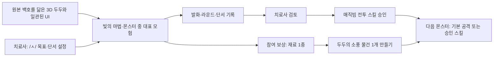

# Speech Hero — 1주일 시연·포스터 기준안

> 상태: **검토용 구현 계약 + 2026-10-03 중간 검증** · 개발 1명, 약 7일, 영상 시연 중심. 아래의 ‘이번 주 목표’는 아직 구현 완료를 뜻하지 않는다.
> 기준 코드: `C:\Users\kor02\orca\s_project`, `fix/phase1-clinical-integrity`의 `83bf0dd` (확인 시 작업 트리 깨끗함)
> 두두 외형 원본: 저장소의 `20190610.010190759320001i1.jpg`(680×821px, 정면). 사용자가 이 백호의 외형을 3D 동작 캐릭터의 기준으로 확정했고 측면·후면 도안은 추가 제공 예정이다.
> 연결 문서: [전체 목표 아키텍처](04_FULL_ARCHITECTURE.md). 이 문서는 그중 **7일 안에 구현·촬영·검증할 작은 수직 흐름**을 정의한다.

## 1. 포스터가 전달할 한 문장

**치료사가 정한 말소리 목표를 아이는 두두와의 모험에서 연습하고, 시스템은 발화 맥락을 정리해 치료사의 다음 결정으로 연결한다.**

발표에서 보여 줄 실제 흐름은 `목표 설정 → 두두의 3D 모험과 발화 → 재료·제작 → 관찰·근거 → 치료사 스킬 승인 → 다음 플레이의 변화`다. 프런트엔드와 게임 장면도 결과물이다. 포스터에서 **기존 실행 화면**, **이번 주 검증된 구현 결과**, **전체 설계**를 색 또는 문구로 구분한다.

## 2. 사실 경계: 실제 구현과 검토 화면

2026-10-03에 원본 저장소를 건드리지 않는 별도 Git 작업 트리 `dudu_worktree`에서 새 프런트엔드와 3D 두두를 실행했다. 샘플 계정과 별도 SQLite 데모 DB로 촬영한 아래 이미지는 **실제 웹 화면**이다. 2026-10-02의 구형 호야·루미 캡처는 비교용으로만 보관한다.

| 실제 화면 | 포스터에서 입증하는 것 | 해석 한계 |
|---|---|---|
| [새 아동 홈](screenshots/actual_dudu_home.png) | 원본 백호를 기준으로 만든 입체 두두, 절제된 홈 UI, 이름 표시 | 측·후면은 도안 대기 중이며 흉장은 근사 재현 |
| [새 몬스터 장면](screenshots/actual_dudu_monster.png) | 실제 앱의 두두·몬스터·1/5·DEMO·목표 발화 장면 | 전투 스킬 승인·서버 권한·재료 제작은 아직 연결되지 않음 |
| [새 치료사 근거·제안](screenshots/actual_therapist.png) | 실제 치료사 화면의 근거 수와 자료 부족 시 목표 유지 제안 | 샘플 DB의 검증 발화 0건. 스킬 승인 UI는 설계 시안뿐 |
| [기존 모험 지도](screenshots/actual_game_map.png) | 기존 4개 활동의 구조 비교 | 새 사용자 화면의 최종 증거로 사용하지 않음 |

새 포스터 [검토본 PPTX](poster/speech_hero_poster_review.pptx)에는 위의 **실제 몬스터·치료사 화면**이 들어 있다. 편집 가능한 [Figma 설계판](https://www.figma.com/design/TtG2zP2Sfa9GtCcePqSrGu)은 원본 그림, 실제 아동 홈·게임 캡처와 스킬 승인 **시안**을 함께 보여 준다. Figma의 승인 버튼은 실제 기능 증거가 아니다. 포스터·영상의 캡션도 실행 화면과 설계 시안을 구분한다.

현재 완료 범위는 새 3D 외형·동작과 아동 홈/지도/대표 몬스터 장면·치료사 표시 화면의 시각 개편이다. **치료사 승인 스킬, 재료·제작, 다른 기기의 라운드 재개, 실제 마이크에서의 완전한 음성 교대는 완료로 표시하지 않는다.** 최종 촬영 조건인 사용자 명칭 통일도 화면 표시만 부분 완료다. 대체 화면과 일부 음성 대사에 ‘호야’가 남아 최종 영상 전 수정·검증이 필요하다.

## 3. 7일의 핵심 시연 범위

### A. 반드시 끝낼 부분

1. **실행·촬영 경로 고정:** 샘플 치료사·아동, DEMO 발화, 4개 활동, 회기 계획 화면을 재현하고 새 3D·프런트엔드 적용 후 다시 촬영한다. 화면에는 DEMO/REAL 표지를 남긴다.
2. **임상 근거의 경계 설명:** 브라우저 음향 특징과 음성 인식 결과는 근사 자료다. 불확실·무발화는 실패가 아니다. 치료사가 확인한 실제 관찰만 회기 계획 근거로 사용한다. 샘플 데이터로 임상 효과를 주장하지 않는다.
3. **AI 기술의 목적 시연:** 현재 6단계 LangGraph는 근거 불러오기→검증 필터→지표 계산→규칙 제안→선택적 LLM 요약→출력 검사다. 계산은 Python 규칙, LLM은 설명만 한다. 자료가 부족할 때 목표 유지·추가 관찰을 제안하는 화면을 보여 준다.
4. **포스터와 영상의 일치:** 포스터에는 실제 화면 2장 이상을 삽입하고, 영상에서 그 화면으로 들어가는 경로를 보여 준다. 화면 사진·영상은 샘플 계정만 사용한다.
5. **3D 두두와 화면 품질:** 원본 백호의 식별 가능한 외형을 가진 조작 가능한 3D 캐릭터를 아동 홈·모험·대화에 일관되게 적용한다. 아동 화면은 깔끔한 인디 모험 게임처럼, 치료사 화면은 읽기 쉬운 전문 도구처럼 다듬는다. Figma MCP 시안은 검토용 설계 증거이며 코드의 실행 증거와 구분한다.

### B. 이번 주의 필수 수직 흐름 — 실제 작동까지 구현하기로 확정

에피소드는 **“두두의 소풍 준비” 1개**로 제한한다. 콘텐츠는 기존 검증 단어 은행에 있는 /ㅅ/ 자극어와 치료사가 확정한 문구만 사용한다. 새로운 /ㄴ/ 음소는 이번 시연에서 임상 과제로 넣지 않는다.

- **기본 공격으로 필수 구간을 끝낼 수 있어야 한다.** 승인 스킬은 몬스터를 다르게 상대하는 선택지다. 미승인을 실패나 벌로 표현하지 않는다.
- **연습 게임 `Magic Beam`과 전투 스킬 `매직빔`은 다른 개념**이다. 연습 게임 완료만으로 전투 스킬을 자동 지급하지 않는다.
- 재료는 **참여·과제 완료를 나타내는 비임상 보상**이다. 발음 점수에 따라 음식 양이나 두두의 행복을 차등하지 않는다. 한 번 보상한 세션을 다시 열어도 중복 지급하지 않는다.
- 짧은 회기에서도 5라운드 구조를 유지하고, 다음에 이어 할 수 있는 중간 저장을 실제로 확인한다. 재료와 완성 물건은 여러 회기에 걸쳐 누적한다. **서버에 활성 회기를 조회하는 진입점**, 중단 중 라운드 시계 정지, 재접속·기기 변경 시 같은 아동의 권한 확인이 필요하다. 현재 `GET /api/activities/{id}`만으로는 다른 기기에서 세션 ID를 찾을 수 없다.
- 치료사 승인 스킬 1개는 실제 서버 권한 확인, 아동 화면의 선택, 몬스터 게임의 다른 공격 연출까지 연결한다. 기본 공격도 같은 필수 구간을 클리어한다. 발음 판정·임상 근거는 선택한 공격에 따라 바뀌지 않는다.
- 7일 안에 어느 연결이 미완성인지 사실대로 점검한다. **완료한 실행 경로만 실제 결과**로 촬영하고 미완성 연결은 “통합 설계”로 표시한다. 구형 호야 화면을 새 두두 구현의 증거로 사용하지 않는다.

### C. 두두 3D·프런트엔드 인수 기준

- **외형:** 저장소 JPG의 흰 백호 비율과 정면 얼굴 윤곽, 검은 줄무늬·눈/코/입, 초록·청록 망토와 목 스카프, 흉장의 위치·색을 유지한다. 기존 도형 조립 호야나 새로 해석한 임의 동물을 두두라고 표시하지 않는다. 한 장의 정면 자료에 없는 측·후면은 추가 도안을 받을 때 확정한다. 680×821px JPG를 포스터 확대용 텍스처로 그대로 늘리지 않는다.
- **실제 3D 동작:** 정면 그림 한 장을 회전시키는 평면 효과가 아니라 공간에서 보이는 머리·몸·팔·망토의 부피와 연결부가 있어야 한다. 기존 `HoyaAction` 17개 값과 `<Hoya3D action className>` 인터페이스는 유지하면서 기본 숨쉬기/눈깜빡임, 듣기, 말하기, 걷기, 집기, 기본 공격, 매직빔의 시연 동작을 매핑한다. WebGL 실패 시에도 원본을 알아볼 수 있는 대체 이미지와 같은 게임 흐름을 제공한다.
- **화면 언어:** 원본의 흰색·짙은 윤곽·초록/청록을 절제된 주색으로 쓰고, 넓은 여백·명확한 정보 계층·선명한 큰 조작 버튼으로 구성한다. 장난감처럼 과밀한 원색·반짝임·유아적 글꼴을 기본 화면에 쓰지 않는다. 작은 아이는 그림·동작으로 이해하고, 보호자·치료사는 텍스트로 상태를 확인할 수 있어야 한다.
- **Figma MCP 작업:** 아동 홈, 모험 지도, 몬스터 전투, 제작, 치료사 검토·스킬 승인 화면의 모바일/데스크톱 시안을 만들고 색·타이포·간격·버튼·상태를 공통 토큰으로 기록한다. Figma 파일/프레임 URL이 생성되면 이 문서에 연결한다. Figma 시안만으로 3D 동작이나 앱 작동을 증명하지 않는다. [Figma의 MCP 설명](https://help.figma.com/hc/en-us/articles/39216419318551-Get-started-with-the-Figma-MCP-server).
- **음성 순서:** 두두의 말풍선과 음성은 짧게 안내하고 완전히 끝난 다음 아이의 말을 듣는다. 아이의 발화가 이어지는 동안 응원 TTS를 예약·재생하지 않는다. 실제 마이크에서 말끝 유예와 TTS 자체 재인식을 확인한다.
- **검수:** 원본 정면/3D 정면을 나란히 비교하고, 3D 회전·동작·망토 관통·모바일 성능·WebGL 대체, 보호자/치료사 읽기 가능성, 게임 중 음성 겹침을 영상과 체크 결과로 남긴다. Figma→코드 화면도 같은 색·구성인지 비교한다.

### D. 이번 주에 넣지 않을 것

4개 게임 전체를 새 장면으로 다시 만들기, 학습형 아동 발음 모델, 새로운 /ㄴ/ 임상 자극어 은행, 아동 영상·원음 저장, RAG 검색, 아동용 별도 LangGraph, 실제 임상 효과 검증. **3D 두두 교체와 대표 게임의 프런트엔드 개선은 이번 주 필수 범위**다. 측·후면 세부 재현은 사용자가 줄 도안을 반영해 확정한다.

## 4. 언어치료 내용을 게임에 연결하는 규칙

말소리 중재는 목표 소리를 안정화하고 음절·단어·문장·대화 등 더 어려운 맥락으로 넓히며 유지 여부를 살핀다. 이는 모든 아동이 네 게임을 같은 순서로 해야 한다는 뜻이 아니다. 언어재활사는 아이의 목표 소리, 단어 안 위치, 단서, 모방/독립 산출을 정한다. 게임은 그 목표를 **이야기 속 발화 기회**로 만든다. [ASHA 말소리장애 지침](https://www.asha.org/practice-portal/clinical-topics/articulation-and-phonology/).

| 이야기 장면 | 과제 예 | 치료사가 보는 맥락 | 표시 금지 |
|---|---|---|---|
| 길을 밝히기 | /ㅅ/ 계열 소리 시작·지속 | 마찰·지속시간·음질·단서 | 정확한 /ㅅ/ 조음 진단 |
| 재료 찾기 | `사과` 그림 보고 말하기 | 모방인지 독립 명명인지, 단어 내 위치 | ASR 문자 일치만으로 정확도 확정 |
| 두두에게 주기 | `사과 주세요` 같은 요청 | 더 긴 발화에서 목표 소리 관찰 | 일상 일반화 달성 |

자극어는 스토리에 맞는 단어를 무작정 생성하지 않는다. 치료사가 허용한 목표·단어 목록과 게임의 측정 가능한 과제 사이에 **호환성 검사**를 둔다.

## 5. AI 안전 하네스: 발표용 정확한 설명

여기서 “하네스”는 인증받은 외부 안전 표준이 아니라 **제품 내부에서 AI의 입력·출력·권한을 묶는 안전 설계**다. 포스터에는 다음 네 줄을 넣는다.

1. **근거 선택:** REAL·비샘플·치료사 확인 자료만 회기 계산에 반영, DEMO는 분리.
2. **역할 제한:** 서버가 지표·제안을 계산하고 LLM은 허용된 근거를 짧게 설명한다.
3. **출력 검사:** 형식, 입력에 없는 숫자·비율, 진단·효과 보장 표현을 검사한다. 실패 시 정해진 템플릿으로 대체한다.
4. **사람의 결정:** 치료 목표·회기 계획·영구 스킬은 언어재활사의 명시적 승인으로만 바뀐다. 스킬 승인은 수직 흐름 구현 목표다.

프롬프트와 모델만으로 안전을 보장하지 않는다. 허용 범위·형식 검증·권한 최소화·사람의 승인은 [OWASP LLM 프롬프트 주입 완화 원칙](https://genai.owasp.org/llmrisk/llm01-prompt-injection/)과 방향이 맞는다. 현재 코드의 안전 장치를 설명하되 **안전 인증 획득**이라고 쓰지 않는다.

## 6. 포스터 개정 지침

첨부 90×120cm 양식의 한 장 구조와 대학 로고는 유지한다. 기존 시안의 60px 안팎 본문 글자를 줄여 **본문 약 44–52px, 제목 약 120–140px** 수준을 목표로 한다. 인쇄 실측 가독성을 미리보기로 확인하고 텍스트를 늘린다.

| 양식 칸 | 넣을 내용 |
|---|---|
| 작품 요약 | 문제: 게임 반복이 치료사의 판단과 분리됨. 해결: 두두의 한 모험에서 발화→놀이→관찰→치료사 결정의 한 루프 |
| 01 개념 및 설계 | **원본 백호 기반 동작 3D 두두**, 임상 단계/단서와 소풍 이야기의 연결, 기본 공격·승인 스킬의 관계 |
| 02 사용기술 | 브라우저 음향·ASR 근사, 6단계 LangGraph, 선택형 LLM, 안전 하네스와 사용 이유 |
| 03 작품 특징 | 절제된 아동/치료사 프런트엔드, 다회기 재료·제작, 아이의 발화를 기다리는 두두, 집/치료실 연속성, 불확실 자료 분리 |
| 04 결과물 | **새 3D 두두가 동작하는 실제 게임 화면 + 실제 치료사 스킬 승인/회기 화면**. 각각 DEMO 샘플/검증된 구현 라벨. Figma 시안은 ‘설계 시안’, 구형 실행 화면은 ‘기존 화면’으로 구분 |
| 05 기대효과 | 아이의 참여 동기와 치료사의 검토 효율이라는 **기대**, 그리고 실제 아동 음성·사용성·효과 검증 필요성 |

영상은 60–90초 한 흐름: `원본과 3D 두두 정면·동작 10초 → 아이 발화/5라운드 중단·재개 20초 → 재료·제작 10초 → 치료사 근거·스킬 승인 20초 → 승인 스킬의 다른 전투와 안전 경계 15초`. 구현이 검증된 화면만 실제 시연으로 표시하고, 미완성 장면은 설계 화면임을 별도 표시한다. 팀명·지도교수·전공·제작자와 최종 영상 QR은 확정 후 넣는다.

## 7. 일정과 중단 기준

| 날 | 완료물 | 중단 기준 |
|---|---|---|
| 1 | 원본 백호 특성표·정면 비교 기준, Figma MCP의 홈/게임/치료사 시안·토큰, 변경 계약·Git 상태 확인 | 도안이 없는 측·후면을 ‘원본과 동일’이라 확정하지 않음 |
| 2 | 실제 부피를 가진 3D 두두·기본 동작·대체 화면, 사용자 문구 두두 통일 | 정면 원본과 식별 가능한 외형이 다르면 캡처하지 않음 |
| 3 | 모험 화면에 두두 동작 연결, 게임/대화 TTS 턴 순서 통합, 실제 마이크·DEMO 확인 | 아이의 말을 끊거나 두두 음성이 재인식되면 해당 경로 촬영 중지 |
| 4 | 소풍 1개·재료 1종·물건 1개, 5라운드 서버 중단/재개와 집·치료실 활성 회기 진입 | 다음 날 재개 직후 라운드 시간 초과나 중복 지급이면 기능 확대 중지 |
| 5 | 치료사 승인 스킬 1개를 서버 권한·아동 선택·몬스터 연출까지 연결, 화면 반응성 조정 | 미승인 사용 차단·기본 공격 클리어가 모두 통과해야 함 |
| 6 | 자동 회귀·실물 브라우저·마이크·3D 성능·접근성·소유권 검수, 포스터/영상 촬영 | DEMO를 REAL 임상 근거로 표시하거나 동결 계약 위반이면 제출 보류 |
| 7 | 새 두두 게임과 치료사 화면으로 사진 교체, 포스터 PPTX/PDF·영상 최종 검토 | 호야/루미 구형 화면, 작동하지 않는 장면을 ‘결과’로 남기지 않음 |

## 8. 사용자가 판단할 결정

1. **확정된 외형·이름 조건:** 저장소 JPG의 흰 백호를 움직이는 3D 두두로 만들고, 사용자 화면의 호야·루미를 두두로 통일하여 최종 화면을 재촬영한다. 측·후면 도안은 추가 제공을 기다려 형태를 확정한다. 현재 포스터와 캡처는 검토본이다.
2. **확정된 구현 깊이:** 치료사 승인 스킬 1개를 실제 작동까지 구현한다. 승인 여부는 서버에 저장하고, 아동의 몬스터 게임 진입·스킬 사용 시 서버가 확인한다. 미승인일 때는 기본 공격으로 같은 필수 구간을 진행한다.
3. **시연 자료:** 영상에 실제 마이크를 쓸지, DEMO를 중심으로 할지. 실제 아동 음성·영상은 명시적 동의와 별도 개인정보 검토 전에는 사용하지 않는다. 대학 백호와 흉장 이미지의 3D 변환·공개 전시 사용 권한도 확인한다.

전체 제품의 상태·데이터 책임·장기 확장은 [전체 목표 아키텍처](04_FULL_ARCHITECTURE.md)에 둔다. 포스터 문구는 **이 문서의 ‘현재/이번 주 목표/장기 설계’ 표기와 일치**해야 한다.

### 동결 계약·Git 충돌 검토

저장소의 `docs/audit/FROZEN_CORE_CONTRACT.md`는 동결 파일을 수정할 때 **변경 파일·이유·계약 영향·회귀 명령을 제시하고 사용자 승인을 받도록** 요구한다. `83bf0dd`의 원본 작업 트리는 깨끗했고, 별도 `dudu_worktree`에서는 3D·화면층 17개 파일만 수정했다. 아래 표는 **완료한 시각 개편과 아직 승인·구현 전인 계약 변경을 구분한 계획**이다. 구현 직전 HEAD·작업 트리·이미 들어온 다른 수정과 충돌 여부를 다시 확인한다.

| 변경 파일 | 이유와 계약 영향 |
|---|---|
| `src/tiger/Hoya3D.tsx` | **별도 작업 트리에서 시각 개편 완료.** 백호 메시·재질·17개 동작을 기존 `<Hoya3D action className>`과 WebGL 대체 계약 안에서 구현했다. `ACTION_TEXT`의 호야 문구는 동결 테스트와 함께 남았다. 측·후면·흉장은 도안/권리 확인 후 정밀화한다. GLB 로더나 새 의존성은 넣지 않았다. |
| `src/pages/*`, `src/child/*` 화면층, `src/styles/*`, `src/character/*`, `src/therapist/*` 화면층 | **별도 작업 트리에서 시각 개편 완료.** 사용자에게 보이는 주요 제목·버튼은 두두로 바꾸고 홈·지도·몬스터·치료사 화면을 촬영했다. 내부 `heroName`은 아이 이름이므로 건드리지 않았다. 게임·대화 TTS/마이크 교대와 레거시 음성 문구는 아직 남은 고위험 작업이다. |
| `backend/app/models.py` | 기존 표·열을 건드리지 않고 아동·스킬·승인 치료사·승인 시각을 담는 `SkillGrant` 표를 추가한다. 회기 계획 승인과 별개로 영구 권한을 보존한다. |
| `backend/app/main.py`, `backend/app/schemas.py`, 새 `backend/app/adventure/*` | 스킬 API, 아동의 활성 회기 조회·일시정지·재개, 몬스터 공격 선택의 서버 권한 확인, 재료 지급 이벤트를 추가한다. 기존 요청은 기본 공격으로 계속 동작하게 한다. `roundStartedAt`에서 잠든 시간을 빼지 않으면 다음 날 첫 발화로 시간이 초과되는 기존 충돌을 수정해야 한다. |
| 비임상 진행 저장소(`EpisodeProgress` 새 표 또는 검토된 별도 상태) | 재료·제작·착용과 보상 지급 완료 이벤트를 관리한다. `ClinicalObservation`이나 영구 스킬을 `collection_json` 재료 수치에 섞지 않는다. 같은 완료 이벤트 재시도·동시 기기에서 한 번만 지급한다. 기존 DB에는 Alembic이 없어 새 표·열 적용 경로를 먼저 확인한다. |
| `backend/app/therapist_planning/*` 또는 연결 어댑터 | 현재 `start_activity`는 `current_goal`로 새 `TrainingPlan`을 만들고 승인된 `TherapistSessionPlan`을 읽지 않는다. 이번 주 스킬 승인은 별도 권한으로 구현하되, ‘승인된 회기 계획대로 게임이 구동된다’는 주장은 실제 연결 검증 전에는 쓰지 않는다. 기존 APPROVED revision의 불변성·근거 필터를 지킨다. |
| `src/therapist/pages/ChildDetail.tsx`, 새 스킬 패널과 API | 치료사가 매직빔 전투 스킬을 승인하고 현재 상태를 본다. 회기 계획의 `APPROVED` 상태와 혼동하지 않는다. |
| `src/child/WorldMap.tsx`, `src/child/ActivitySession.tsx`, 활동 API 타입 | 승인된 스킬만 선택지로 보여 주고 몬스터 5라운드의 공격 표현에 반영한다. 발음 평가 결과는 바꾸지 않는다. |
| 관련 백엔드·프런트 테스트 | 미승인 사용 차단, 승인·중복 승인/철회, 다른 치료사·아동 접근 차단, 기본 공격 클리어, 스킬 사용과 DEMO 구분, 중단 후 시간 계산, 두 기기 재개·중복 재료, TTS→마이크→응답 순서, 3D 대체를 확인한다. |

인증 쿠키·CSRF·치료사 `owned_child`·학생의 자기 `child_id` 검사, 계획 revision 불변성, DEMO/REAL/SEED 근거 분리는 유지한다. 보존 동의 없는 원음 업로드나 LLM의 스킬 직접 승인은 이 범위에 없다. 회귀 명령: `backend\.venv\Scripts\python.exe -m pytest backend -q`, `npm.cmd test`, `npm.cmd run typecheck`, `npm.cmd run build`, 데모 서버의 `backend\.venv\Scripts\python.exe backend\scripts\smoke_api.py`, `git diff --check`, `npm.cmd audit`. 이 환경에서는 원본 가상환경 실행기의 기초 Python 경로가 없으므로 동등한 번들 Python과 그 가상환경 패키지를 사용하고, 임시 DB·테스트 폴더는 분리한다. 테스트 명령만으로 3D 충실도·실제 마이크·임상 효과가 증명되지는 않으므로 별도 화면/기기 검수가 필요하다. 동결 경로 수정 전에는 변경 파일·계약 영향·회귀 계획을 확인한다.
