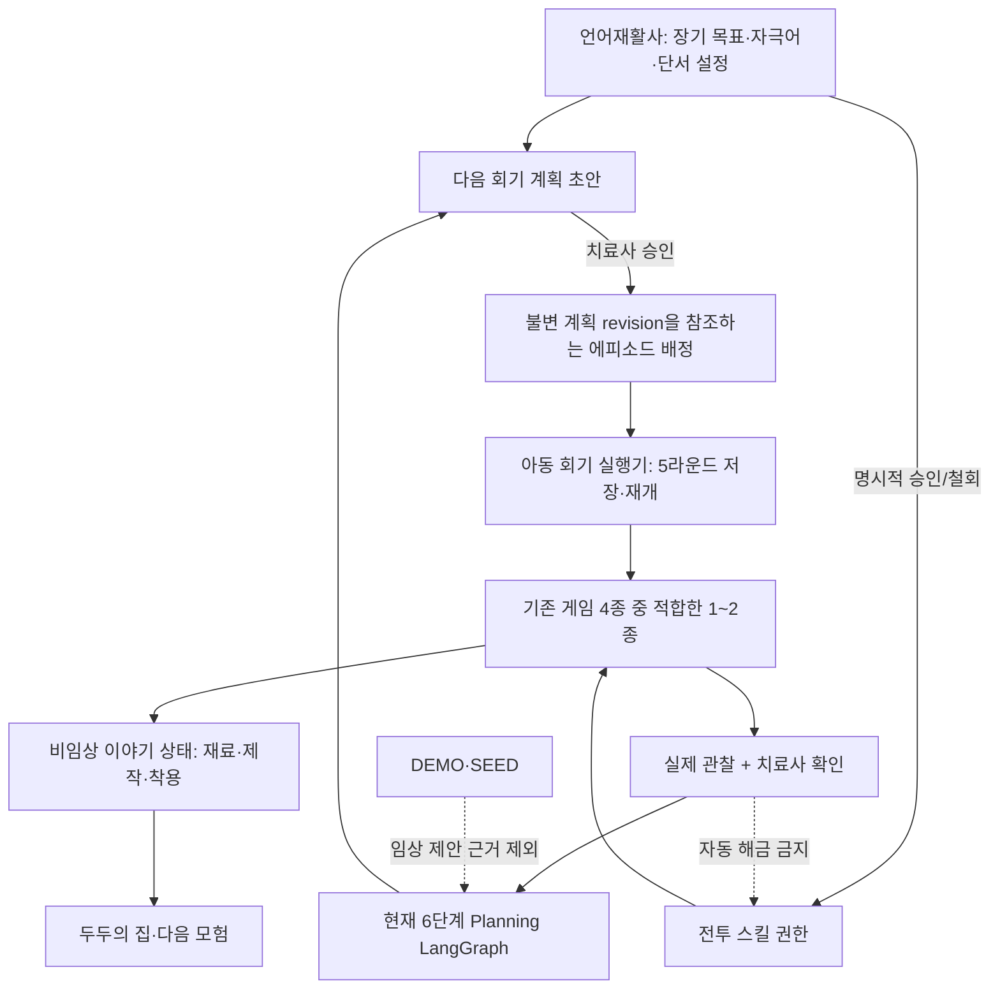
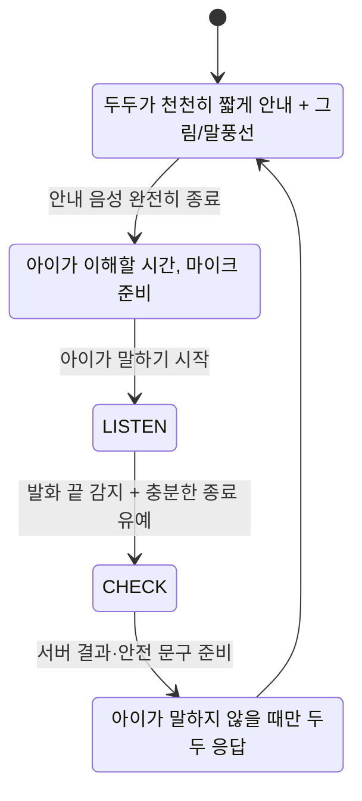
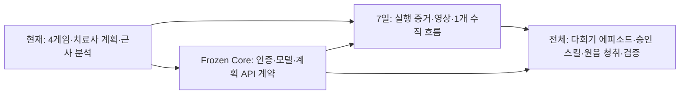

# Speech Hero — 전체 통합 아키텍처 검토안

> 상태: **제품 통합 설계 검토안 + 2026-10-03 구현 점검**. 아래 표의 ‘기준 저장소’는 `83bf0dd`, ‘7일’은 완료가 아닌 구현 목표, ‘전체’는 장기 확장이다.
> 이 문서는 최초 인수 당시의 설계·상태 스냅샷이다. 당시 ‘3D 두두’라고 부른 실행 캐릭터는 **최종 모델이 아닌 2.5D 시제품**이다. 치료사 스킬·재료·이어하기의 이후 구현과 검사는 [새 기기 작업 기록](05_DEVICE_CONTINUATION.md)을 따른다. Figma·포스터 시안은 실행 증거가 아니다.
> 기준: 기존 V3·V4 문서, 저장소 `fix/phase1-clinical-integrity`의 `83bf0dd`, 실제 실행 화면, 사용자 결정, 루트의 백호 원본 `20190610.010190759320001i1.jpg`(정면 680×821px)
> 연결 문서: [1주일 시연·포스터 범위](03_WEEK_SCOPE.md). 이 문서는 7일 구현 범위를 넘어서는 **제품의 책임 경계와 확장 방향**을 정의한다.

## 0. 이미 결정된 제품 원칙

1. 아이에게는 **두두와 이어지는 모험**, 언어재활사에게는 **발화 맥락과 확인 가능한 근거**를 제공한다.
2. 아이의 목표 소리·위치·연습 수준·단서·자극어·다음 회기는 치료사가 정한다. AI는 진단이나 치료 결정을 하지 않는다.
3. 네 기존 활동의 5라운드 치료 목적을 유지한다. 게임은 서로 따로 끝나지 않고 **한 에피소드의 재료·제작·다음 이야기**로 이어진다. 모든 아동이 네 활동을 순서대로 해야 하는 것은 아니다.
4. 재료는 여러 회기에 걸쳐 모은다. 짧은 5·10·15분 회기는 5라운드 도중 저장하고 이어 할 수 있어야 한다.
5. 기본 공격으로 필수 몬스터 구간은 진행된다. 치료사가 승인한 영구 스킬은 **다른 해결 방법**을 늘린다. 승인하지 않은 것을 벌·결핍으로 표현하지 않는다.
6. 두두는 게임에서도 말할 수 있다. **다정한 또래 친구처럼 천천히**, 아이가 듣고 대답할 시간을 주고, 아이의 발화와 음성이 겹치거나 발화 끝을 잘라서는 안 된다. 실제 목소리 제공자와 음색은 미정이다.
7. 글을 읽기 어려운 4~7세 아동을 위해 그림·동작을 기본으로 하고, 보호자·치료사의 보조를 허용한다. 집과 치료실을 처음부터 같은 수준의 사용 맥락으로 설계한다.
8. 짧은 아동 발화 원음을 보호자 동의 아래 저장해 치료사가 직접 듣는 기능은 **장기 목표**다. 현재 서버는 원음을 저장하지 않는다.
9. 두두는 사용자가 제공한 **흰 백호 원본 외형 그대로 인지되는 동작 가능한 3D 캐릭터**여야 한다. 기준 저장소의 도형 조립 호야를 별도 작업 트리에서 입체 두두로 교체했다. 정면을 먼저 맞추고 추가 제공될 측·후면 도안으로 3D 형태를 확정한다.
10. 아동과 치료사 프런트엔드는 함께 설계한다. 아동 화면은 그림·행동 중심이되 과하게 유아적인 장식 대신 정돈된 인디 모험 게임의 품질을 지향하고, 치료사 화면은 근거와 결정이 읽히는 전문 작업 화면으로 만든다. Figma MCP는 편집 가능한 시안과 토큰 검토에 사용하며 작동 증거는 실제 앱에서 확보한다.

## 1. 현재 구현과 전체 목표의 관계

| 영역 | 기준 저장소 `83bf0dd`에서 확인 | 7일 포스터·시연 범위 | 전체 목표 |
|---|---|---|---|
| 캐릭터·프런트엔드 | 기존 `Hoya3D`는 기본 도형 조립, 🐯 대체 화면. 호야 홈·루미 랜딩, 텍스트 위주 지도/보상 | 원본 흰 백호의 정면을 맞춘 동작 3D 두두, 이름 통일, Figma MCP 기반 홈·대표 게임·치료사 화면 재설계와 실제 촬영 | 측·후면 도안 반영, 4개 게임 전체의 같은 디자인 시스템과 동작 확장 |
| 아동 경험 | 4개 5라운드 활동과 별도 지도·보상 | 소풍 에피소드 1개와 재료·물건·다음 몬스터의 수직 흐름 실제 연결 | 여러 에피소드·제작·착용·다회기 이야기 |
| 발화 | 브라우저 음향 특징, Web Speech 기반 텍스트, 규칙·근사 판정 | DEMO/REAL 구분을 영상에 명시, 대표 라운드 안정화 | 목표별 자극·단서 호환성, 치료사 청취용 동의 음성, 전문가 검증 |
| 게임 연결 | 각 활동과 지도·보상이 느슨하게 연결. 세션 ID는 브라우저 `sessionStorage`에만 보유 | 재료 1종·물건 1개·치료사 승인 전투 스킬 1개, 활성 회기 조회·5라운드 중단/재개를 실제 연결 | 배정 게임이 한 에피소드에 기여, 모든 상태 복구·동시 기기 중복 보상 방지 |
| 치료사 | 관찰 검증, 목표, LangGraph 회기 계획 생성·수정·승인. 승인 계획은 현재 게임 시작에 전달되지 않음 | 근거 부족 안전 사례와 별도 스킬 승인·아동 게임 반영을 실제 시연 | 승인 계획 revision을 아동 런타임에 연결, 스킬 승인·철회 이력 |
| AI | 6단계 한 방향 LangGraph, 선택형 LLM 요약, 출력 검사·템플릿 대체 | 기술의 **사용 이유와 제약**을 포스터에 설명 | 필요할 때만 상태형 실행·근거 검색 확장. 치료사 승인 유지 |
| 근거·안전 | REAL/DEMO/SEED 분리 설계, 일부 Phase 1 수정 중 | 데모와 임상 근거를 섞지 않는 것을 시연·표기 | 출처 추적·동의·보존·검증·감사 기록의 일관성 |

기준 저장소가 네 활동·계획 기능을 가진다는 것과 **통합 에피소드·승인 스킬이 이미 실행된다**는 것은 다르다. 별도 작업 트리에서 새 3D 두두와 화면은 실행되지만 게임 상태 연결은 미완료다. 포스터와 영상은 이를 구분한다. 기존 V4의 “게임 중 말풍선만”은 사용자가 이후 **게임에서도 두두가 말하되 아이의 말을 기다린다**고 수정했으므로 이 문서에서 대체한다.

### 1.1 별도 작업 트리의 실측 상태 (2026-10-03)

원본 저장소 `C:\Users\kor02\orca\s_project`의 기준 커밋은 그대로 두고, 이 프로젝트 폴더의 `dudu_worktree`에서 진행했다. 흰 백호 얼굴·줄무늬·망토·스카프·흉장을 3D 메시로 재구성하고 17개 기존 동작 인터페이스를 보존했다. 아동 홈·지도·대표 몬스터 화면, 치료사 근거 화면의 표시를 개편했다. [실제 아동 홈](screenshots/actual_dudu_home.png), [실제 몬스터 화면](screenshots/actual_dudu_monster.png), [실제 치료사 화면](screenshots/actual_therapist.png)을 샘플 DB로 촬영했다. [Figma 설계판](https://www.figma.com/design/TtG2zP2Sfa9GtCcePqSrGu)은 편집 가능한 홈·게임·치료사 시안과 실제 캡처를 담으며, [포스터 검토본](poster/speech_hero_poster_review.pptx)은 실제 게임·치료사 화면을 사용한다.

| 연결 | 확인된 실행 | 남은 계약/검증 |
|---|---|---|
| 3D 두두 → 홈·대표 게임 | 실제 WebGL 화면과 기존 동작 API, DEMO 1라운드 진입 | 측·후면 도안, 흉장 정확도, 저사양 모바일·WebGL 대체 실물 검수 |
| 치료사 근거 → 회기 제안 | 자료 0건일 때 목표 유지·추가 관찰 제안을 샘플 계정으로 확인 | 승인된 계획이 게임 시작을 구동하는 경로 없음 |
| 치료사 스킬 승인 → 몬스터 | Figma에는 승인 UI **시안**이 있음 | 서버 권한·감사 이력·아동 선택·전투 적용 모두 구현 전 |
| 재료 → 제작 → 다음 회기 | 이야기와 중복 지급 방지 규칙을 설계 | 서버 상태와 기기 간 이어 하기 구현 전 |
| 두두 음성 → 아동 응답 | 기존 TTS·마이크 경로를 사용 | 일부 대사에 ‘호야’가 남고 응답 TTS의 마이크 겹침을 실물 검증해야 함 |

검증 기록은 화면 실행과 프런트엔드 타입 검사·94개 테스트·빌드다. 이 결과는 **임상 효과, 실제 마이크 교대, 치료사 승인 스킬의 작동**을 입증하지 않는다. 포스터에서 ‘구현’은 앞의 두 실행 화면에만 붙인다.

## 2. 제품 아키텍처: 하나의 에피소드, 두 종류의 상태



**임상 상태와 이야기 상태를 분리**한다. `ClinicalObservation`과 치료사 검증은 발화의 출처·맥락을 다룬다. 재료·옷·음식·몬스터·별은 비임상 진행이다. 이야기가 끝났다는 사실을 치료 목표 달성이나 정확한 발음으로 환산하지 않는다.

### 소유권과 불변성

- `TrainingGoal`: 장기 치료 목표와 버전.
- `TherapistSessionPlan`: 다음 한 회기. `APPROVED` revision은 수정하지 않고 새 revision으로 바꾼다.
- `EpisodeAssignment` **신규 제안**: 승인된 계획 revision, 허용 활동, 확정 자극어, 에피소드 템플릿을 연결한다. 승인 계획 자체에 게임 진행 상태를 덮어쓰지 않는다.
- `TherapyRun` **신규 제안**: 현재 활동·라운드·중단 지점·완료 이벤트를 소유한다. 기존 5라운드 평가 결과를 다시 계산하지 않는다.
- `EpisodeProgress` **신규 제안**: 재료·제작·착용·장면, 지급 완료 세션 ID. 비임상 상태다.
- `SkillGrant` **신규 제안**: 치료사·아동·스킬·승인/철회 시점·판단 근거 유형과 메모. 세션 완료나 LLM 출력으로 생성되지 않는다.

한 활동 완료 이벤트에 대해 재료 지급은 **한 번만** 처리한다. 서버 재시도, 새로고침, 두 기기 동시 접근으로 재료가 늘어나지 않아야 한다. 승인된 계획이 바뀌어도 이미 기록한 발화·게임 결과의 당시 목표 버전은 보존한다.

## 3. 언어치료 설계: 활동의 역할을 섞지 않는다

[ASHA의 말소리장애 자료](https://www.asha.org/practice-portal/clinical-topics/articulation-and-phonology/)는 목표 소리의 확립, 음절·단어·문장·대화로의 사용 확대, 유지와 자기 점검을 구분한다. 어떤 목표를 선택하고 어떤 중재 접근을 쓸지는 언어재활사의 판단이다. Speech Hero의 라운드 순서는 임상적으로 검증된 단일 치료 프로토콜이 아니다.

| 활동 | 기존 과제의 의미 | 이야기 역할 예 | 남길 근거와 한계 |
|---|---|---|---|
| Magic Beam 연습 게임 | 적합한 소리의 지속·마찰·리듬·음절 전이 | 어두운 길을 밝힘 | 시간·고주파 등 음향 근거. /ㅅ/의 정확한 조음 진단은 아님 |
| Sky Climb | 발성 시작·지속·쉼 후 재개 | 높은 곳의 재료 찾기 | 발성 조절 관찰. 호흡 장애 검사로 해석하지 않음 |
| Monster Adventure | 음절 모방→단어 모방→그림 명명→새 장면→구 | 재료를 지키는 몬스터를 지나감 | 모방/독립성·목표음 위치·ASR 근사 결과. 새 장면은 미훈련 단어 검사와 다름 |
| Conversation Quest | 선택·요청·구·문장·이야기 반응 | 두두와 물건 선택·모험 회상 | 목표음이 관찰됐는지. 대화의 질·일상 일반화 판정은 아님 |

**치료사 입력 단위:** 목표 음소, 단어 안 위치, 시작/목표 수준, 자극어, 제외 단어, 허용 단서, 모방/독립 산출, 허용 활동, 회기 길이. 게임 콘텐츠는 그 범위에 맞는 장면만 사용한다. /ㅅ/의 `사과`가 재료로 나오면, 같은 단어를 그림 보고 말하기·`사과 주세요` 요청·만든 음식 회상에 쓸 수 있다. 단어가 이야기와 관련 있어야 반복이 자연스럽다. 다만 자극어마다 실제 발음 위치·난도와 그림 적합성을 치료사가 검토한다.

현재 자극어 은행은 /ㅅ/·/ㅈ/·/ㄹ/ 중심이고 /ㄴ/ 자료가 없다. /ㄴ/를 추가할 때는 단어 목록만 늘리지 않고 **목표 음소–과제–신호 평가의 호환성**을 검증한다. 특히 Magic Beam의 마찰·길이 신호를 /ㄴ/ 조음 정확도 판정으로 재사용하지 않는다.

## 4. 게임 진행: 선택권과 치료사 상호작용

첫 에피소드는 `두두의 소풍 준비`다. 아이가 두두에게 필요한 모자와 간식을 고르고, 치료사가 배정한 활동에서 재료를 찾는다. 만들기는 여러 회기에 걸쳐 완성한다. 완성한 모자·음식은 집과 다음 모험 장면에 반영하고, 두두가 지난 모험을 대화 소재로 기억한다. 1개 활동만 배정되어도 기본 물건을 완성할 수 있어야 한다.

```text
소풍 목표 선택 → 배정 모험 → 발화 기회 → 재료 → 만들기/착용
      ↑                                             ↓
      └──── 두두의 다음 대화·장면에 결과 반영 ───────┘

치료사 관찰·판단 → 스킬 승인/철회 → 다음 몬스터에서 사용 가능
```

처음 몬스터는 기본 주먹/짧은 행동으로 통과할 수 있다. 치료사가 매직빔 전투 스킬을 승인하면 이후 같은 몬스터를 다른 방식으로 해결할 수 있다. `Magic Beam` **연습 게임**은 발화 과제이고, 몬스터에서 쓰는 `매직빔` **전투 스킬 권한**은 별도다. 임시 강화는 옷·음식에서 오는 짧은 시각 효과나 한 번의 도움 정도로 두고 임상 평가 기준을 바꾸지 않는다. 치료사가 승인하지 않았어도 아이는 기본 공격과 배정된 연습으로 이야기를 이어 간다.

스킬 승인 UI는 단순한 “통과 점수 이상” 버튼이 아니다. 치료사는 실제 관찰, 직접 본 수행, 단서 의존성, 피로·주의, 다음 회기 목표 등을 보고 승인하거나 보류한다. 앱 밖 치료실 관찰로 승인했다면 근거 출처를 `치료실 직접 관찰`로 남긴다. AI 제안은 참고이며 스킬의 소유권을 변경할 권한이 없다.

게임 참고는 **원리만** 가져온다. 예를 들어 Archero류의 점진적 스킬 선택, 동행 캐릭터 게임의 돌봄·제작 동기를 참고하되 화면·캐릭터·확률 구조를 복제하지 않는다. 랜덤 전리품, 상점, 굶김 게이지, 강제 반복은 핵심 치료 흐름에 넣지 않는다.

## 5. 두두의 음성·아이 발화 순서

두두의 최종 음성 엔진·목소리는 미정이다. 이번 설계의 **행동 계약**은 먼저 정한다.



- TTS가 끝나기 전에는 그 소리를 아이 발화로 전송하지 않는다. 아이가 말하는 동안 두두의 응원 음성·보상 음성이 끼어들지 않는다.
- 안내 뒤 바로 조급한 시간 제한을 주지 않는다. 무발화는 실패·패배가 아니라 기다리기/그림 힌트/보호자·치료사 도움의 분기다.
- 현재 브라우저 음성 파이프라인의 종료 유예(기본 약 700ms, 과제에 따라 더 김)를 재사용하되, 아동이 말을 쉬어 가는 장면에서 잘리지 않는지 실물 마이크로 확인한다. 과제별 대기 시간은 임상 표준이라고 주장하지 않는다.
- 4~7세에게 문장을 읽으라고 요구하지 않는다. 그림·동작이 먼저이며 말풍선은 어른의 보조와 함께 쓰인다. 음성은 접근성을 돕되 제공자와 음색은 비교 후 결정한다.
- 집과 치료실의 상호작용 원칙은 같다. 치료사는 필요하면 두두 안내를 끄거나 단서 수준을 조정할 수 있다.

### 두두 목소리 후보 — 아직 선택하지 않음

| 후보 | 1주 시연에서의 이점 | 확인할 점 |
|---|---|---|
| 현재 브라우저 `speechSynthesis` | 이미 쓰는 음성 경로로 짧은 안내를 검증하기 쉽다 | 사용 가능한 한국어 목소리는 기기·브라우저의 목록에 따라 달라진다. 같은 두두 목소리를 여러 기기에서 보장하기 어렵다. [MDN 음성 목록](https://developer.mozilla.org/en-US/docs/Web/API/SpeechSynthesis/getVoices) |
| 사람이 녹음한 고정 대사 | 인사·격려·발음 시범의 음색과 말속도를 일정하게 검수할 수 있다 | 목표 단어와 이름이 바뀌는 문장을 모두 녹음하기 어렵다. 녹음자의 이용 허락과 대사 수정 비용이 필요하다. |
| 서버의 한국어 TTS | 치료사가 고른 문구도 같은 음색으로 합성할 수 있다 | 네트워크·지연·운영비·제공자 약관과 발화 텍스트 전송을 검토해야 한다. 실제 한국어 후보를 듣고 음소 시범의 명료도를 확인한다. [Google Cloud 한국어 음성 목록](https://cloud.google.com/text-to-speech/docs/voices) |

선택 기준은 **4~7세가 알아듣는 한국어 발음**, 느리고 다정한 또래 느낌, 음절 시범의 명료도, 집·치료실의 일관성, 응답 지연, 동의·운영비다. 어느 후보든 두두 음성이 끝났다는 신호와 마이크 재개를 연결하고, 아이가 말하는 동안 다음 대사를 재생하지 않는다. 현재 시연의 브라우저 음성을 두두의 최종 목소리로 확정하지 않는다.

## 6. AI 구조와 안전 하네스

### 현재 LangGraph가 하는 일

현재 치료사 계획 그래프는 `LoadPlanningContext → FilterVerifiedEvidence → CalculateMetrics → GeneratePlanProposal → GenerateSummary → ValidateOutput`의 **한 방향 6단계**다. 루프·도구 호출·아동 회기 실행·RAG는 없다. `GenerateSummary`에서 설정을 켰을 때만 LLM을 한 번 부르고, 실패·검증 거부 시 템플릿 요약으로 돌아간다. LangGraph를 쓰는 이유는 결정적 계산과 선택적 생성 문장의 경계를 노드로 분리해 추적·수정하기 쉽기 때문이다. 공식 문서도 결정적 단계와 모델 단계를 함께 다루는 제어를 핵심 용도로 설명한다. [LangGraph 공식 문서](https://docs.langchain.com/oss/python/langgraph/overview/).

### 제품 내부 안전 하네스

| 경계 | 현재/목표 제어 | 실패 시 |
|---|---|---|
| 입력 출처 | REAL·비샘플·치료사 확인 관찰만 계획 수치에 사용. DEMO/SEED 분리 | 근거 부족을 명시하고 목표 유지·추가 관찰 |
| 입력 최소화 | 치료사 요약 LLM에는 이름·ID·play code·원문 발화·메모·단어 목록을 보내지 않음 | 필요 없는 정보는 전달하지 않음 |
| 역할 제한 | 수치는 Python, LLM은 설명. 아동 대화 LLM에는 도구 없음 | LLM이 치료 결정·스킬·DB를 직접 변경할 수 없음 |
| 출력 검사 | 구조화 형식, 길이, 금지 표현, 입력에 없는 숫자·비율 검사 | 생성문 폐기, 검증된 템플릿 대체 |
| 임상 권한 | 계획·목표·스킬은 치료사가 수정·승인·거절 | 승인 전에는 아동 회기에 적용하지 않음 |
| 감사 | 근거 출처·계획 revision·검증·스킬 승인자를 남김 | 과거 결정을 재현·철회 가능하도록 설계 |

“AI 하네스”는 이처럼 AI의 **허용 입력, 허용 행동, 출력 검사, 안전 대체, 인간 승인**을 코드와 데이터 경계로 구현하는 것을 뜻한다. 외부 기관의 안전 인증이나 무오류 보증은 아니다. [OWASP의 입력·출력 검증 및 최소 권한 원칙](https://genai.owasp.org/llmrisk/llm01-prompt-injection/), [NIST AI 위험 관리 틀](https://www.nist.gov/itl/ai-risk-management-framework)을 설계 참고로 삼되, 준수 인증을 주장하지 않는다.

### 향후 AI 확장 선택 기준

- **아동용 TherapyRun LangGraph:** 회기 중단·재개, 승인 계획에 따른 분기, 게임/대화/제작 상태를 실제로 함께 조정해야 할 때만 도입한다. 단순 화면 이동과 5라운드 상태 전이는 기존 결정적 상태 기계가 담당한다. 중단·재개와 사람 승인 경계가 없어도 된다면 새 그래프를 만들지 않는다.
- **근거 RAG:** 현재는 검토된 짧은 임상 맥락만 사용한다. 향후 치료사가 연구 근거를 보려면 승인된 문헌만 색인하고 판본·쪽/절·검색 근거를 화면에 보여 준다. 검색 문장을 치료 처방으로 바로 바꾸지 않고 치료사가 읽고 선택한다. 출처 없는 문장은 계획 근거로 쓰지 않는다.
- **학습형 발음 모델:** 한국 아동 목표음 라벨, 화자 분리 평가, 오류 비용·기기 편차·권리 확인이 갖춰지기 전에는 현재 근사 분석을 임상 판정 모델로 소개하지 않는다.

## 7. 데이터·동의·검증 계획

현재 앱은 원본 음성을 서버에 저장하지 않고, 브라우저 음향 요약과 필요한 경우 Web Speech 인식 문장을 다룬다. 실제 음성 모드에서 브라우저 제공자에게 음성이 전송될 수 있다는 고지를 유지한다. DEMO 스크립트 결과는 실제 관찰·효과 통계에서 분리한다.

장기 목표인 **짧은 발화 구간 저장**은 별도 동의·보존·접근 설계가 먼저다. 보호자 동의 범위와 철회 방법, 암호화 저장, 치료사별 소유권, 최소 길이·보존 기간, 삭제 및 감사 기록, 원음성에서 얻은 분석값의 출처를 정한다. 치료사는 알고리즘 점수와 함께 원음을 듣고 확인·교정할 수 있어야 한다. 이 기능이 나오기 전에는 “치료사가 아이 발화를 직접 청취한다”고 포스터에 쓰지 않는다.

검증은 순서가 다르다. **기능 시험**(재시도·중복 보상·권한·영상 재현) → **기술적 발화 평가**(전문가 라벨·기기·소음·화자 분리) → **치료실 사용성** → **임상 효과 연구**다. 기능이 돌아간다는 이유로 언어치료 효과를 주장하지 않는다.

## 8. 프론트엔드·게임 UI 원칙

- 아동 화면: 그림/동작 중심, 세로형. 한 번에 하나의 목표와 하나의 요청. 5라운드 위치, 현재 재료, 두두의 반응을 볼 수 있다. 모험 중 아이의 발화를 방해하는 팝업과 동시 음성을 피한다.
- 게임 화면: 소리 입력과 게임 동작의 인과가 즉시 보인다. 기본 공격과 승인 스킬을 구분한다. 목표에 맞지 않는 스킬·자극어는 숨기거나 배정하지 않는다. 잘못된 ASR 결과로 아이에게 실패 낙인을 찍지 않는다.
- 두두의 집: 여러 회기의 재료, 만들 물건, 이미 만든 옷·음식과 다음 모험의 연결을 보여 준다. 배고픔·피로를 벌로 쓰지 않는다.
- 치료사 화면: 목표·근거·검증 상태·해석 한계·승인 결정의 순서다. DEMO/REAL, 샘플, 미검증, 불확실을 한 점수로 합치지 않는다. 스킬 승인에는 현재 권한·승인자·근거와 철회가 보인다.
- 시각 참고는 게임의 **구조와 피드백 원리**에 한정한다. 실제 에셋·상표·화면을 복제하지 않는다. 현재 코드의 루미/호야 명칭은 사용자 화면에서 두두로 정리하되 기존 DB·API 호환 이름은 이전 계획을 세워 변경한다.

## 9. 구현 순서와 계약 충돌



1. **Phase 1 임상 무결성**을 기준으로 DEMO/SEED 혼입 위험을 먼저 막는다. 현재 브랜치는 WIP이므로 완성·병합으로 표시하지 않는다.
2. 사용자 화면의 두두 명칭·소풍 콘텐츠·실제 화면을 맞춘다. 내부 `hoya_*` 테이블과 API 이름을 한 번에 바꾸지 않는다.
3. 비임상 에피소드 상태를 작은 범위로 도입한다. 영구 스킬 권한은 재료 상태에 넣지 않는다.
4. 치료사 승인 계획·스킬 권한을 아동 게임에 읽기 전용으로 전달한다. 보안 소유권·CSRF와 불변 revision 계약을 지킨다.
5. 대표 게임 두 개가 하나의 재료·스킬 흐름을 공유하면 나머지 게임으로 확장한다.
6. 동의 음성 저장·RAG·추가 음소·새 그래프는 별도 검증과 결정 이후 진행한다.

저장소의 `docs/audit/FROZEN_CORE_CONTRACT.md`는 `backend/app/models.py`, 치료사 계획 API, 인증·음성 인터페이스의 계약 변경 전에 **변경 파일·이유·계약 영향·회귀 명령을 제시하고 사용자 승인을 받도록** 요구한다. 이 문서는 계약을 자동으로 바꾸지 않는다. 특히 `SkillGrant` 새 표, 새 오디오 저장, API 경로·스키마 변경은 구현 직전에 그 검토가 필요하다. 1주일 포스터의 설계와 실제 구현을 분리하는 이유다.

## 10. 1주일 문서와의 연결 규칙

두 문서는 서로 다른 제품이 아니다. 7일 문서는 **전체 아키텍처의 수직 단면**이다.

| 공통 계약 | 7일 단면 | 전체 확장 |
|---|---|---|
| 치료사 권한 | 목표·활동 계획 화면과 스킬 1개 실제 승인·아동 게임 반영 | 권한 이력·철회·여러 스킬 |
| 임상 근거 | 현재 REAL/DEMO 구분과 자료 부족 안전 사례 | 동의 원음 청취·전문가 검증·근거 RAG |
| 아동 모험 | 4개 기존 게임 중 1~2개, 소풍 1개, 물건 1개 | 여러 에피소드·물건, 4개 게임의 공유 런타임 |
| 이야기 상태 | 재료 1종, 중복 지급 방지·이어 하기 | 재료·제작·착용·장면 지속, 복구·동시성 강화 |
| AI | 현재 6단계 LangGraph와 선택형 LLM·검사 | 필요할 때만 TherapyRun 상태형 그래프·문헌 검색 |
| 발표 근거 | 샘플 계정의 실제 실행 캡처·DEMO 고지 | 실제 사용자 검증 후 결과와 구분 |

**변경 역류 규칙:** 주간 데모를 만들다가 전체 설계의 임상·안전 경계를 바꾸면 먼저 이 문서에서 이유를 설명한다. 전체 설계를 위해 7일 범위를 늘리지는 않는다. 포스터의 “구현됨” 표시는 실제 실행 캡처와 코드·테스트가 있을 때만 붙인다.

## 11. 사용자 판단이 필요한 지점

1. **확정된 포스터 사진 조건:** 새 3D 두두의 아동 홈·몬스터·치료사 화면은 다시 촬영했다. 대체 화면과 일부 발화 대사에 남은 ‘호야’를 정리하고 음성 교대를 실물 검증한 뒤 최종 영상에 넣는다. 현재 포스터와 캡처는 검토본이다.
2. **확정된 1주일 목표:** 치료사 승인 스킬 1개를 서버 권한 확인부터 몬스터 게임의 다른 공격 표현까지 실제 동작시킨다. 기본 공격은 승인 없이도 필수 구간을 클리어한다. 스킬 권한 기록은 회기 계획과 분리하며 Frozen Core 변경 검토가 필요하다. 구현 전 계약 제안과 회귀 명령은 [1주일 범위 문서](03_WEEK_SCOPE.md)의 8절을 따른다.
3. **두두 음성 후보:** 느리고 다정한 또래 느낌이라는 방향은 정해졌지만 제공자·음색·라이선스·오프라인 동작은 미정이다. 후보를 비교한 뒤 선택한다.
4. **짧은 원음 보관:** 사용자가 원한 치료사 직접 청취는 전체 목표로 유지한다. 보존 기간·동의 철회·접근 범위를 정한 후에만 구현한다.

## 12. 참고 근거

- 프로젝트 코드와 감사: `README.md`, `docs/v2/SPEECH_THERAPY_AI_CLINICAL_RATIONALE.md`, `docs/audit/PRODUCT_REALITY_MATRIX.md`, `docs/audit/FROZEN_CORE_CONTRACT.md`, `backend/app/therapist_planning/graph.py` (로컬 저장소, 2026-10-02 확인).
- [ASHA: Speech Sound Disorders—Articulation and Phonology](https://www.asha.org/practice-portal/clinical-topics/articulation-and-phonology/): 목표 소리 확립·사용 맥락 확대·유지와 치료사 역할.
- [LangGraph 공식 개요](https://docs.langchain.com/oss/python/langgraph/overview/): 결정적 단계와 LLM 단계의 분리, 상태형 워크플로 기능.
- [OWASP LLM01 Prompt Injection](https://genai.owasp.org/llmrisk/llm01-prompt-injection/): 역할 제한·형식 검증·최소 권한·사람 승인.
- [NIST AI Risk Management Framework](https://www.nist.gov/itl/ai-risk-management-framework): 위험 관리 참고. 인증 주장 아님.
